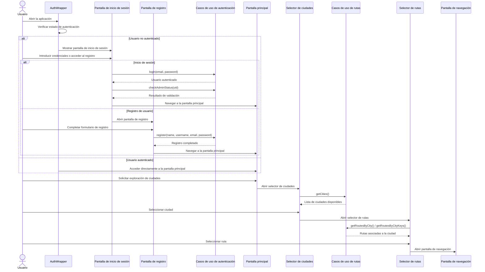
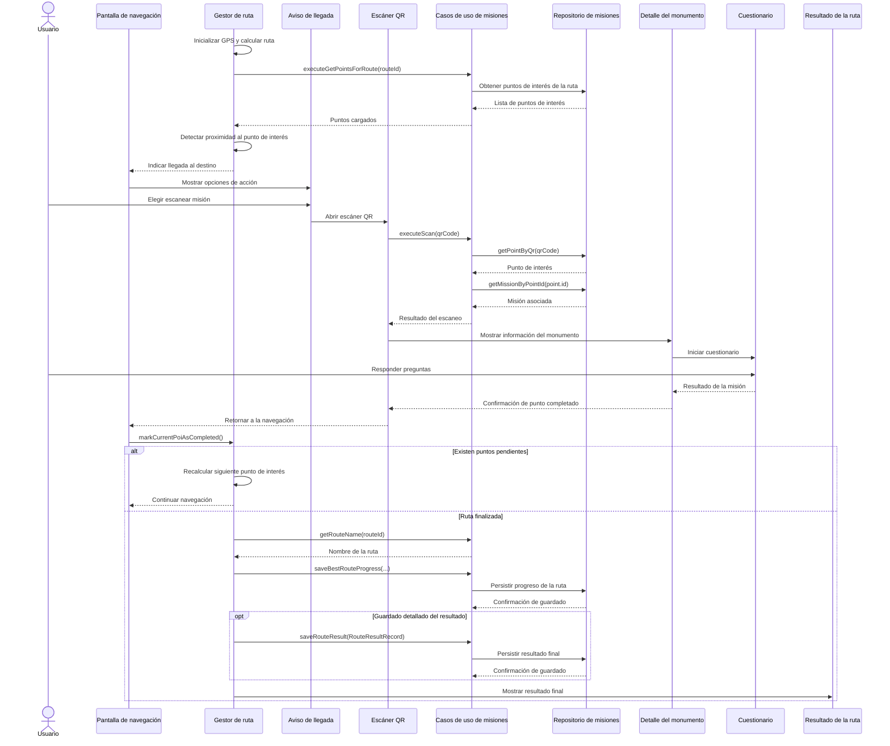

```mermaid
sequenceDiagram
    actor Usuario
    participant AuthWrapper
    participant LoginScreen as Pantalla de inicio de sesión
    participant RegisterScreen as Pantalla de registro
    participant AuthUseCases as Casos de uso de autenticación
    participant HomeScreen as Pantalla principal
    participant CitySelectionScreen as Selector de ciudades
    participant RoutesUseCases as Casos de uso de rutas
    participant RouteSelectionScreen as Selector de rutas
    participant MapNavigationScreen as Pantalla de navegación

    Usuario->>AuthWrapper: Abrir la aplicación
    AuthWrapper->>AuthWrapper: Verificar estado de autenticación

    alt Usuario no autenticado
        AuthWrapper->>LoginScreen: Mostrar pantalla de inicio de sesión
        Usuario->>LoginScreen: Introducir credenciales o acceder al registro

        alt Inicio de sesión
            LoginScreen->>AuthUseCases: login(email, password)
            AuthUseCases-->>LoginScreen: Usuario autenticado
            LoginScreen->>AuthUseCases: checkAdminStatus(uid)
            AuthUseCases-->>LoginScreen: Resultado de validación
            LoginScreen->>HomeScreen: Navegar a la pantalla principal
        else Registro de usuario
            LoginScreen->>RegisterScreen: Abrir pantalla de registro
            Usuario->>RegisterScreen: Completar formulario de registro
            RegisterScreen->>AuthUseCases: register(name, username, email, password)
            AuthUseCases-->>RegisterScreen: Registro completado
            RegisterScreen->>HomeScreen: Navegar a la pantalla principal
        end
    else Usuario autenticado
        AuthWrapper->>HomeScreen: Acceder directamente a la pantalla principal
    end

    Usuario->>HomeScreen: Solicitar exploración de ciudades
    HomeScreen->>CitySelectionScreen: Abrir selector de ciudades
    CitySelectionScreen->>RoutesUseCases: getCities()
    RoutesUseCases-->>CitySelectionScreen: Lista de ciudades disponibles

    Usuario->>CitySelectionScreen: Seleccionar ciudad
    CitySelectionScreen->>RouteSelectionScreen: Abrir selector de rutas
    RouteSelectionScreen->>RoutesUseCases: getRoutesByCity() / getRoutesByCityKeys()
    RoutesUseCases-->>RouteSelectionScreen: Rutas asociadas a la ciudad

    Usuario->>RouteSelectionScreen: Seleccionar ruta
    RouteSelectionScreen->>MapNavigationScreen: Abrir pantalla de navegación
```

```mermaid
sequenceDiagram
    actor Usuario
    participant MapNavigationScreen as Pantalla de navegación
    participant TripSimulationProvider as Gestor de ruta
    participant ArrivalBottomSheet as Aviso de llegada
    participant MissionScannerScreen as Escáner QR
    participant MissionUseCases as Casos de uso de misiones
    participant MissionRepository as Repositorio de misiones
    participant MonumentInfoScreen as Detalle del monumento
    participant QuizScreen as Cuestionario
    participant RouteResultScreen as Resultado de la ruta

    TripSimulationProvider->>TripSimulationProvider: Inicializar GPS y calcular ruta
    TripSimulationProvider->>MissionUseCases: executeGetPointsForRoute(routeId)
    MissionUseCases->>MissionRepository: Obtener puntos de interés de la ruta
    MissionRepository-->>MissionUseCases: Lista de puntos de interés
    MissionUseCases-->>TripSimulationProvider: Puntos cargados

    TripSimulationProvider->>TripSimulationProvider: Detectar proximidad al punto de interés
    TripSimulationProvider-->>MapNavigationScreen: Indicar llegada al destino

    MapNavigationScreen->>ArrivalBottomSheet: Mostrar opciones de acción
    Usuario->>ArrivalBottomSheet: Elegir escanear misión

    ArrivalBottomSheet->>MissionScannerScreen: Abrir escáner QR
    MissionScannerScreen->>MissionUseCases: executeScan(qrCode)
    MissionUseCases->>MissionRepository: getPointByQr(qrCode)
    MissionRepository-->>MissionUseCases: Punto de interés

    MissionUseCases->>MissionRepository: getMissionByPointId(point.id)
    MissionRepository-->>MissionUseCases: Misión asociada
    MissionUseCases-->>MissionScannerScreen: Resultado del escaneo

    MissionScannerScreen->>MonumentInfoScreen: Mostrar información del monumento
    MonumentInfoScreen->>QuizScreen: Iniciar cuestionario

    Usuario->>QuizScreen: Responder preguntas
    QuizScreen-->>MonumentInfoScreen: Resultado de la misión
    MonumentInfoScreen-->>MissionScannerScreen: Confirmación de punto completado
    MissionScannerScreen-->>MapNavigationScreen: Retornar a la navegación

    MapNavigationScreen->>TripSimulationProvider: markCurrentPoiAsCompleted()

    alt Existen puntos pendientes
        TripSimulationProvider->>TripSimulationProvider: Recalcular siguiente punto de interés
        TripSimulationProvider-->>MapNavigationScreen: Continuar navegación
    else Ruta finalizada
        TripSimulationProvider->>MissionUseCases: getRouteName(routeId)
        MissionUseCases-->>TripSimulationProvider: Nombre de la ruta

        TripSimulationProvider->>MissionUseCases: saveBestRouteProgress(...)
        MissionUseCases->>MissionRepository: Persistir progreso de la ruta
        MissionRepository-->>MissionUseCases: Confirmación de guardado

        opt Guardado detallado del resultado
            TripSimulationProvider->>MissionUseCases: saveRouteResult(RouteResultRecord)
            MissionUseCases->>MissionRepository: Persistir resultado final
            MissionRepository-->>MissionUseCases: Confirmación de guardado
        end

        TripSimulationProvider->>RouteResultScreen: Mostrar resultado final
    end
```
