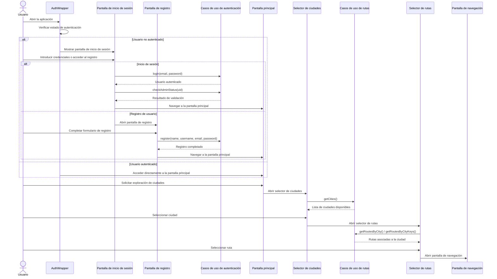
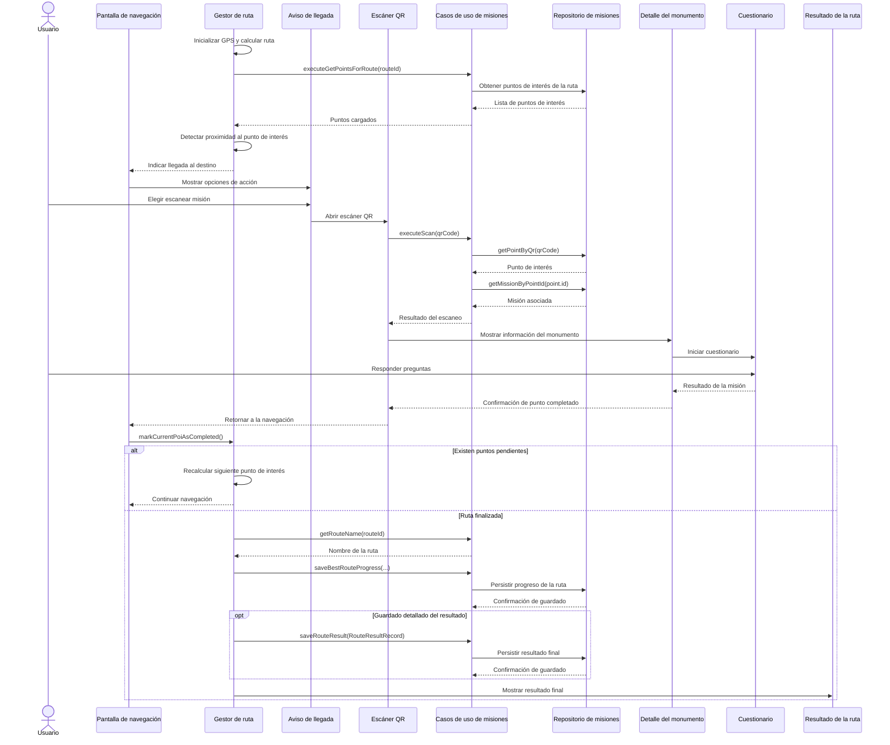

***Diagrama de Secuencia 1***


---

***Diagrama de Secuencia 2***



---

***Diagrama de Flujo***

```mermaid
flowchart TD
    A[Inicio: Usuario abre la aplicación] --> B{¿Existe sesión activa?}

    B -- No --> C[Mostrar pantalla de autenticación]
    C --> D{¿Acción del usuario?}
    D -- Iniciar sesión --> E[Validar credenciales]
    D -- Registrarse --> F[Registrar nuevo usuario]

    E --> G{¿Autenticación correcta?}
    G -- No --> H[Mostrar error de autenticación]
    H --> C
    G -- Sí --> I[Acceder a pantalla principal]

    F --> J{¿Registro correcto?}
    J -- No --> K[Mostrar error de registro]
    K --> C
    J -- Sí --> I

    B -- Sí --> I

    I --> L[Mostrar opciones principales]
    L --> M[Acceder al selector de ciudades]
    M --> N[Obtener ciudades disponibles]
    N --> O[Mostrar listado de ciudades]
    O --> P[Usuario selecciona ciudad]

    P --> Q[Obtener rutas asociadas a la ciudad]
    Q --> R[Mostrar rutas disponibles]
    R --> S[Usuario selecciona ruta]
    S --> T[Abrir pantalla de navegación]

    T --> U[Inicializar gestor de ruta]
    U --> V[Obtener puntos de interés de la ruta]
    V --> W[Iniciar seguimiento GPS y cálculo de trayecto]

    W --> X{¿Se alcanza un punto de interés?}
    X -- No --> W
    X -- Sí --> Y[Mostrar aviso de llegada al punto]

    Y --> Z{¿Acción en el punto?}
    Z -- Escanear QR --> AA[Abrir escáner QR]
    Z -- Omitir punto --> AB[Marcar punto como omitido/completado sin misión]

    AA --> AC[Leer código QR]
    AC --> AD[Validar punto y misión asociada]
    AD --> AE{¿QR válido y punto esperado?}
    AE -- No --> AF[Mostrar mensaje de QR no válido]
    AF --> AA
    AE -- Sí --> AG[Mostrar detalle del monumento]

    AG --> AH[Iniciar cuestionario de misión]
    AH --> AI[Usuario responde preguntas]
    AI --> AJ[Calcular resultado de la misión]
    AJ --> AK[Registrar punto como completado]

    AB --> AL[Actualizar progreso de ruta]
    AK --> AL

    AL --> AM{¿Quedan puntos pendientes?}
    AM -- Sí --> AN[Recalcular siguiente destino]
    AN --> W

    AM -- No --> AO[Finalizar ruta]
    AO --> AP[Calcular puntuación final y métricas]
    AP --> AQ[Guardar mejor progreso de ruta]
    AQ --> AR{¿Corresponde guardar resultado detallado?}
    AR -- Sí --> AS[Guardar resultado detallado de la ruta]
    AR -- No --> AT[Continuar sin guardado detallado]

    AS --> AU[Mostrar pantalla de resultados finales]
    AT --> AU

    AU --> AV{¿Usuario desea iniciar nueva ruta?}
    AV -- Sí --> M
    AV -- No --> AW[Fin del proceso]
```


---

**Diagrama de Casos de Uso**
```mermaid
graph TB
    subgraph Actores[""]
        U["👤 Usuario"]
        ADM["👨‍💼 Administrador"]
        FB["☁️ Firebase"]
    end
    
    subgraph CasosDeUso["CASOS DE USO - RUTEX-GO"]
        subgraph Auth["Autenticación"]
            UC1["Autenticarse"]
            UC2["Registrarse"]
            UC3["Recuperar contraseña"]
        end
        
        subgraph Explore["Exploración"]
            UC4["Explorar ciudades"]
            UC5["Ver rutas disponibles"]
        end
        
        subgraph Select["Selección"]
            UC6["Seleccionar ciudad"]
            UC7["Seleccionar ruta"]
        end
        
        subgraph Nav["Navegación"]
            UC8["Iniciar navegación"]
            UC9["Escanear QR"]
            UC10["Ver detalle de monumento"]
        end
        
        subgraph Mission["Misión"]
            UC11["Realizar cuestionario"]
            UC12["Guardar progreso"]
        end
        
        subgraph Results["Resultados"]
            UC13["Ver resultados de ruta"]
            UC14["Compartir resultado"]
        end
        
        subgraph Profile["Perfil"]
            UC15["Ver/editar perfil"]
        end
        
        subgraph Admin["Administración"]
            UC16["Acceder panel admin"]
            UC17["Gestionar rutas y puntos"]
            UC18["Subir/editar misiones"]
            UC19["Gestionar resultados"]
        end
    end
    
    U -->|usa| UC1
    U -->|usa| UC2
    U -->|usa| UC3
    U -->|usa| UC4
    U -->|usa| UC5
    U -->|usa| UC6
    U -->|usa| UC7
    U -->|usa| UC8
    U -->|usa| UC9
    U -->|usa| UC10
    U -->|usa| UC11
    U -->|usa| UC12
    U -->|usa| UC13
    U -->|usa| UC14
    U -->|usa| UC15
    
    ADM -->|usa| UC16
    ADM -->|usa| UC17
    ADM -->|usa| UC18
    ADM -->|usa| UC19
    
    UC8 -.->|permite| UC9
    UC9 -.->|requiere| UC10
    UC11 -.->|incluye| UC12
    
    UC1 -.->|validación| FB
    UC2 -.->|registro| FB
    UC12 -.->|persistencia| FB
    UC17 -.->|gestión| FB
    UC18 -.->|gestión| FB
    
    style U fill:#4CAF50,stroke:#2E7D32,stroke-width:2px,color:#fff
    style ADM fill:#FF9800,stroke:#E65100,stroke-width:2px,color:#fff
    style FB fill:#2196F3,stroke:#1565C0,stroke-width:2px,color:#fff
    style Auth fill:#E8F5E9,stroke:#4CAF50
    style Explore fill:#E3F2FD,stroke:#2196F3
    style Select fill:#FFF3E0,stroke:#FF9800
    style Nav fill:#FCE4EC,stroke:#E91E63
    style Mission fill:#F3E5F5,stroke:#9C27B0
    style Results fill:#E0F2F1,stroke:#009688
    style Profile fill:#FFF9C4,stroke:#FBC02D
    style Admin fill:#FFEBEE,stroke:#F44336
```
