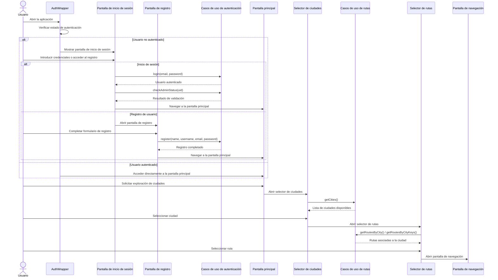
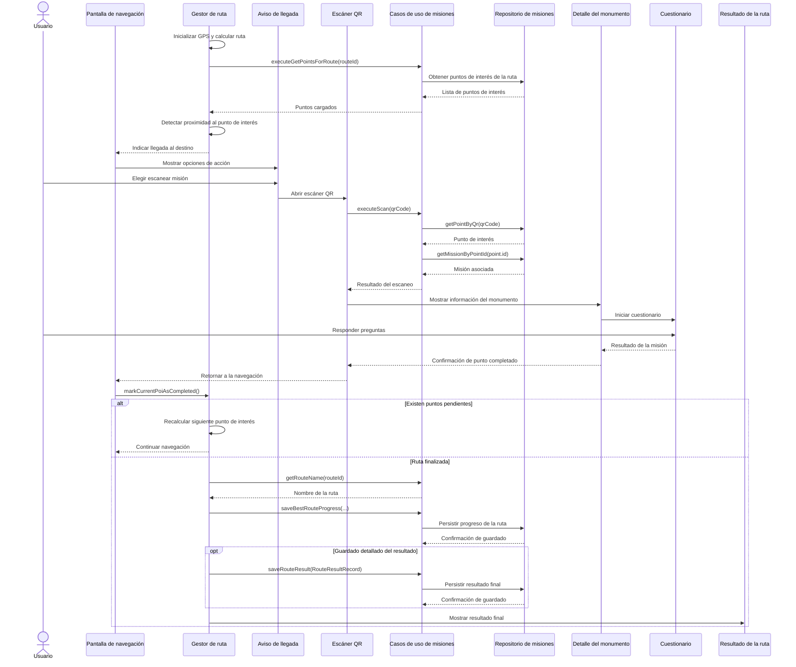

***Diagrama de Secuencia 1***


---

***Diagrama de Secuencia 2***



---

***Diagrama de Flujo***

```mermaid
flowchart TD
    A[Inicio: Usuario abre la app] --> B{¿Sesión activa?}

    subgraph F1["Fase 1: Autenticación"]
        direction TB
        C[Mostrar autenticación]
        D{¿Acción?}
        E[Validar credenciales]
        F[Registrar usuario]
        G{¿Autenticación correcta?}
        H{¿Registro correcto?}
        I[Mostrar error]
        J[Acceder a pantalla principal]

        C --> D
        D -- Iniciar sesión --> E --> G
        D -- Registrarse --> F --> H
        G -- No --> I --> C
        H -- No --> I
        G -- Sí --> J
        H -- Sí --> J
    end

    B -- No --> C
    B -- Sí --> J

    subgraph F2["Fase 2: Selección de ciudad y ruta"]
        direction TB
        K[Mostrar opciones principales]
        L[Abrir selector de ciudades]
        M[Obtener ciudades disponibles]
        N[Usuario selecciona ciudad]
        O[Obtener rutas de la ciudad]
        P[Mostrar rutas disponibles]
        Q[Usuario selecciona ruta]
        R[Abrir pantalla de navegación]

        K --> L --> M --> N --> O --> P --> Q --> R
    end

    J --> K

    subgraph F3["Fase 3: Navegación y misión"]
        direction TB
        S[Inicializar gestor de ruta]
        T[Obtener POIs de la ruta]
        U[Iniciar GPS y cálculo de trayecto]
        V{¿Se alcanza un POI?}
        W[Mostrar aviso de llegada]
        X{¿Acción en el punto?}
        Y[Abrir escáner QR]
        Z[Marcar punto omitido/completado]
        AA[Leer QR]
        AB[Validar punto y misión]
        AC{¿QR válido?}
        AD[Mostrar detalle del monumento]
        AE[Iniciar cuestionario]
        AF[Responder preguntas]
        AG[Calcular resultado]
        AH[Registrar punto completado]
        AI[Actualizar progreso]

        S --> T --> U --> V
        V -- No --> U
        V -- Sí --> W --> X
        X -- Escanear QR --> Y --> AA --> AB --> AC
        X -- Omitir punto --> Z --> AI
        AC -- No --> Y
        AC -- Sí --> AD --> AE --> AF --> AG --> AH --> AI
    end

    R --> S

    subgraph F4["Fase 4: Cierre de ruta y resultados"]
        direction TB
        AJ{¿Quedan puntos pendientes?}
        AK[Recalcular siguiente destino]
        AL[Finalizar ruta]
        AM[Calcular puntuación final]
        AN[Guardar mejor progreso]
        AO{¿Guardar resultado detallado?}
        AP[Guardar resultado detallado]
        AQ[Mostrar resultados finales]
        AR{¿Iniciar nueva ruta?}
        AS[Volver a selector de ciudades]
        AT[Fin]

        AJ -- Sí --> AK
        AK --> U
        AJ -- No --> AL --> AM --> AN --> AO
        AO -- Sí --> AP --> AQ
        AO -- No --> AQ
        AQ --> AR
        AR -- Sí --> AS
        AR -- No --> AT
    end

    AI --> AJ
    AS --> L

    style F1 fill:#E8F5E9,stroke:#4CAF50,stroke-width:2px
    style F2 fill:#E3F2FD,stroke:#2196F3,stroke-width:2px
    style F3 fill:#F3E5F5,stroke:#9C27B0,stroke-width:2px
    style F4 fill:#FFF3E0,stroke:#FF9800,stroke-width:2px
```


---

**Diagrama de Casos de Uso**
```mermaid
flowchart LR
    U["👤 USUARIO TURISTA"]

    subgraph USUARIO_CASOS["Casos de Uso - Usuario Turista"]
        direction TB
        
        subgraph AUTH["Autenticación"]
            U1["Login/Registro"]
            U2["Recuperar contraseña"]
            U3["Logout"]
        end

        subgraph EXPLORE["Exploración"]
            U4["Ver ciudades"]
            U5["Ver rutas por ciudad"]
            U6["Seleccionar ruta"]
        end

        subgraph MISSION["Misión Gamificada"]
            U7["Iniciar navegación"]
            U8["Escanear QR"]
            U9["Ver detalle monumento"]
            U10["Realizar quiz"]
            U11["Ver resultados ruta"]
        end

        subgraph PROFILE["Perfil"]
            U12["Ver perfil"]
            U13["Ver diario explorador"]
        end
    end

    USUARIO_CASOS --> ADMIN_SPACER[""]

    A["👨‍💼 ADMINISTRADOR"]

    subgraph ADMIN_CASOS["Casos de Uso - Administrador"]
        direction TB
        
        subgraph ADMIN_FUNC["Administración"]
            A1["Acceder panel admin"]
            A2["Gestionar ciudades"]
            A3["Gestionar rutas"]
            A4["Gestionar POIs"]
            A5["Gestionar misiones"]
        end
    end

    %% Relaciones Usuario
    U --> U1
    U --> U2
    U --> U3
    U --> U4
    U --> U5
    U --> U6
    U --> U7
    U --> U8
    U --> U9
    U --> U10
    U --> U11
    U --> U12
    U --> U13

    %% Relaciones Administrador
    A --> A1
    A --> A2
    A --> A3
    A --> A4
    A --> A5

    %% Estilos
    style U fill:#4CAF50,stroke:#2E7D32,stroke-width:2px,color:#fff
    style A fill:#FF9800,stroke:#E65100,stroke-width:2px,color:#fff
    style ADMIN_SPACER fill:none,stroke:none

    style USUARIO_CASOS fill:none,stroke:#999,stroke-width:2px,stroke-dasharray:5 5
    style ADMIN_CASOS fill:none,stroke:#999,stroke-width:2px,stroke-dasharray:5 5

    style AUTH fill:#E8F5E9,stroke:#4CAF50,stroke-width:1px
    style EXPLORE fill:#E3F2FD,stroke:#2196F3,stroke-width:1px
    style MISSION fill:#F3E5F5,stroke:#9C27B0,stroke-width:1px
    style PROFILE fill:#FFF9C4,stroke:#FBC02D,stroke-width:1px
    style ADMIN_FUNC fill:#FFEBEE,stroke:#F44336,stroke-width:1px
```
