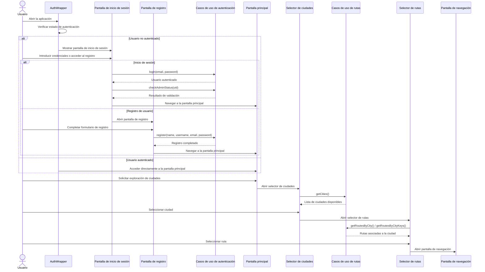
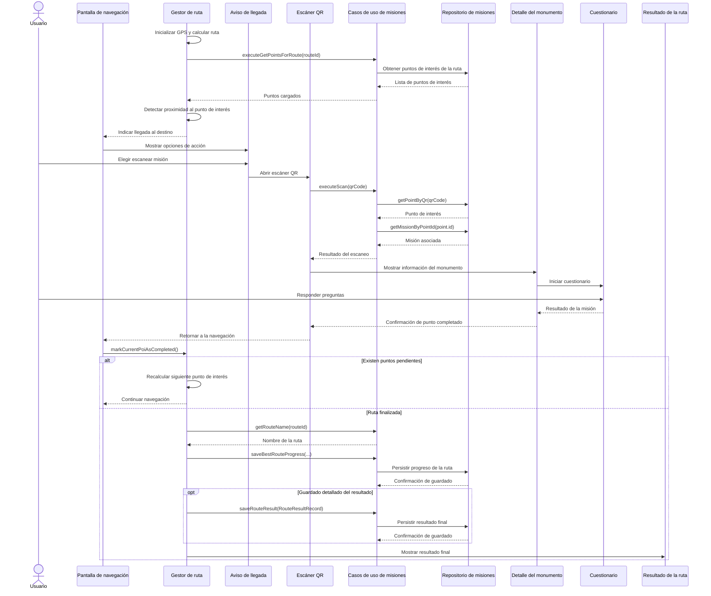
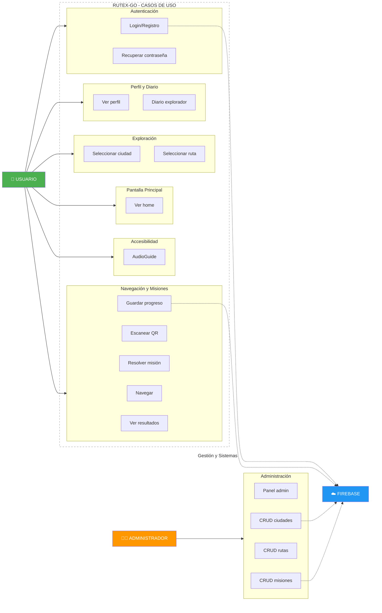

***Diagrama de Secuencia 1***

```mermaid
sequenceDiagram
    actor Usuario
    participant AuthWrapper
    participant LoginScreen as Pantalla de inicio de sesión
    participant RegisterScreen as Pantalla de registro
    participant AuthUseCases as Casos de uso de autenticación
    participant HomeScreen as Pantalla principal
    participant CitySelectionScreen as Selector de ciudades
    participant RoutesUseCases as Casos de uso de rutas
    participant RouteSelectionScreen as Selector de rutas
    participant MapNavigationScreen as Pantalla de navegación

    Usuario->>AuthWrapper: Abrir la aplicación
    AuthWrapper->>AuthWrapper: Verificar estado de autenticación

    alt Usuario no autenticado
        AuthWrapper->>LoginScreen: Mostrar pantalla de inicio de sesión
        Usuario->>LoginScreen: Introducir credenciales o acceder al registro

        alt Inicio de sesión
            LoginScreen->>AuthUseCases: login(email, password)
            AuthUseCases-->>LoginScreen: Usuario autenticado
            LoginScreen->>AuthUseCases: checkAdminStatus(uid)
            AuthUseCases-->>LoginScreen: Resultado de validación
            LoginScreen->>HomeScreen: Navegar a la pantalla principal
        else Registro de usuario
            LoginScreen->>RegisterScreen: Abrir pantalla de registro
            Usuario->>RegisterScreen: Completar formulario de registro
            RegisterScreen->>AuthUseCases: register(name, username, email, password)
            AuthUseCases-->>RegisterScreen: Registro completado
            RegisterScreen->>HomeScreen: Navegar a la pantalla principal
        end
    else Usuario autenticado
        AuthWrapper->>HomeScreen: Acceder directamente a la pantalla principal
    end

    Usuario->>HomeScreen: Solicitar exploración de ciudades
    HomeScreen->>CitySelectionScreen: Abrir selector de ciudades
    CitySelectionScreen->>RoutesUseCases: getCities()
    RoutesUseCases-->>CitySelectionScreen: Lista de ciudades disponibles

    Usuario->>CitySelectionScreen: Seleccionar ciudad
    CitySelectionScreen->>RouteSelectionScreen: Abrir selector de rutas
    RouteSelectionScreen->>RoutesUseCases: getRoutesByCity() / getRoutesByCityKeys()
    RoutesUseCases-->>RouteSelectionScreen: Rutas asociadas a la ciudad

    Usuario->>RouteSelectionScreen: Seleccionar ruta
    RouteSelectionScreen->>MapNavigationScreen: Abrir pantalla de navegación
```

---

***Diagrama de Secuencia 2***

```mermaid
sequenceDiagram
    actor Usuario
    participant MapNavigationScreen as Pantalla de navegación
    participant TripSimulationProvider as Gestor de ruta
    participant ArrivalBottomSheet as Aviso de llegada
    participant MissionScannerScreen as Escáner QR
    participant MissionUseCases as Casos de uso de misiones
    participant MissionRepository as Repositorio de misiones
    participant MonumentInfoScreen as Detalle del monumento
    participant QuizScreen as Cuestionario
    participant RouteResultScreen as Resultado de la ruta

    TripSimulationProvider->>TripSimulationProvider: Inicializar GPS y calcular ruta
    TripSimulationProvider->>MissionUseCases: executeGetPointsForRoute(routeId)
    MissionUseCases->>MissionRepository: Obtener puntos de interés de la ruta
    MissionRepository-->>MissionUseCases: Lista de puntos de interés
    MissionUseCases-->>TripSimulationProvider: Puntos cargados

    TripSimulationProvider->>TripSimulationProvider: Detectar proximidad al punto de interés
    TripSimulationProvider-->>MapNavigationScreen: Indicar llegada al destino

    MapNavigationScreen->>ArrivalBottomSheet: Mostrar opciones de acción
    Usuario->>ArrivalBottomSheet: Elegir escanear misión

    ArrivalBottomSheet->>MissionScannerScreen: Abrir escáner QR
    MissionScannerScreen->>MissionUseCases: executeScan(qrCode)
    MissionUseCases->>MissionRepository: getPointByQr(qrCode)
    MissionRepository-->>MissionUseCases: Punto de interés

    MissionUseCases->>MissionRepository: getMissionByPointId(point.id)
    MissionRepository-->>MissionUseCases: Misión asociada
    MissionUseCases-->>MissionScannerScreen: Resultado del escaneo

    MissionScannerScreen->>MonumentInfoScreen: Mostrar información del monumento
    MonumentInfoScreen->>QuizScreen: Iniciar cuestionario

    Usuario->>QuizScreen: Responder preguntas
    QuizScreen-->>MonumentInfoScreen: Resultado de la misión
    MonumentInfoScreen-->>MissionScannerScreen: Confirmación de punto completado
    MissionScannerScreen-->>MapNavigationScreen: Retornar a la navegación

    MapNavigationScreen->>TripSimulationProvider: markCurrentPoiAsCompleted()

    alt Existen puntos pendientes
        TripSimulationProvider->>TripSimulationProvider: Recalcular siguiente punto de interés
        TripSimulationProvider-->>MapNavigationScreen: Continuar navegación
    else Ruta finalizada
        TripSimulationProvider->>MissionUseCases: getRouteName(routeId)
        MissionUseCases-->>TripSimulationProvider: Nombre de la ruta

        TripSimulationProvider->>MissionUseCases: saveBestRouteProgress(...)
        MissionUseCases->>MissionRepository: Persistir progreso de la ruta
        MissionRepository-->>MissionUseCases: Confirmación de guardado

        opt Guardado detallado del resultado
            TripSimulationProvider->>MissionUseCases: saveRouteResult(RouteResultRecord)
            MissionUseCases->>MissionRepository: Persistir resultado final
            MissionRepository-->>MissionUseCases: Confirmación de guardado
        end

        TripSimulationProvider->>RouteResultScreen: Mostrar resultado final
    end
```

---

***Diagrama de Flujo***

```mermaid
flowchart LR
    subgraph AUTH["1. Autenticación"]
        direction TB
        A1[Inicio] --> A2{¿Sesión activa?}
        A2 -- Sí --> A3[Pantalla principal]
        A2 -- No --> A4[Mostrar autenticación]
        A4 --> A5{¿Acción?}
        A5 -- Login --> A6[Validar credenciales]
        A5 -- Registro --> A7[Registrar usuario]
        A6 --> A8{¿Correcto?}
        A7 --> A9{¿Correcto?}
        A8 -- Sí --> A3
        A8 -- No --> A4
        A9 -- Sí --> A3
        A9 -- No --> A4
    end

    subgraph SEL["2. Selección"]
        direction TB
        B1[Pantalla principal] --> B2[Mostrar ciudades]
        B2 --> B3[Seleccionar ciudad]
        B3 --> B4[Obtener rutas]
        B4 --> B5[Mostrar rutas]
        B5 --> B6[Seleccionar ruta]
        B6 --> B7[Ir a navegación]
    end

    subgraph MISSION["3. Navegación y misión"]
        direction TB
        C1[Ir a navegación] --> C2[Inicializar gestor de ruta]
        C2 --> C3[Obtener POIs]
        C3 --> C4[Iniciar GPS]
        C4 --> C5{¿Llegada a POI?}
        C5 -- No --> C4
        C5 -- Sí --> C6[Mostrar aviso de llegada]
        C6 --> C7{¿Acción?}
        C7 -- Escanear QR --> C8[Abrir escáner]
        C7 -- Omitir --> C9[Marcar punto completado]
        C8 --> C10[Leer QR]
        C10 --> C11[Validar misión]
        C11 --> C12{¿QR válido?}
        C12 -- No --> C8
        C12 -- Sí --> C13[Mostrar detalle monumento]
        C13 --> C14[Iniciar quiz]
        C14 --> C15[Responder preguntas]
        C15 --> C16[Calcular resultado]
        C16 --> C17[Registrar punto completado]
        C9 --> C18[Actualizar progreso]
        C17 --> C18
    end

    subgraph ENDING["4. Cierre"]
        direction TB
        D1[Actualizar progreso] --> D2{¿Quedan puntos?}
        D2 -- Sí --> D3[Recalcular siguiente destino]
        D3 --> D4[Volver a navegación]
        D2 -- No --> D5[Finalizar ruta]
        D5 --> D6[Calcular puntuación final]
        D6 --> D7[Guardar mejor progreso]
        D7 --> D8{¿Guardar detalle?}
        D8 -- Sí --> D9[Guardar resultado detallado]
        D8 -- No --> D10[Continuar]
        D9 --> D11[Mostrar resultados finales]
        D10 --> D11
        D11 --> D12{¿Nueva ruta?}
        D12 -- Sí --> B1
        D12 -- No --> D13[Fin]
    end

    %% Conexiones entre bloques
    A3 --> B1
    B7 --> C1
    C18 --> D1

    %% Estilos
    style AUTH fill:#E8F5E9,stroke:#4CAF50,stroke-width:2px
    style SEL fill:#E3F2FD,stroke:#2196F3,stroke-width:2px
    style MISSION fill:#F3E5F5,stroke:#9C27B0,stroke-width:2px
    style ENDING fill:#FFF3E0,stroke:#FF9800,stroke-width:2px
```

---

**Diagrama de Casos de Uso**

```mermaid
flowchart LR
    %% COLUMNA 1: El inicio
    U["👤 USUARIO"]

    %% COLUMNA 2: LA APP (Apilada verticalmente)
    subgraph APP ["RUTEX-GO - CASOS DE USO"]
        direction TB
        
        subgraph ACC ["Accesibilidad"]
            ACC1["AudioGuide"]
        end

        subgraph AUTH ["Autenticación"]
            AUTH1["Login/Registro"]
            AUTH2["Recuperar contraseña"]
        end

        subgraph HOME ["Pantalla Principal"]
            HOME1["Ver home"]
        end

        subgraph EXP ["Exploración"]
            EXP1["Seleccionar ciudad"]
            EXP2["Seleccionar ruta"]
        end

        subgraph PROF ["Perfil y Diario"]
            PROF1["Ver perfil"]
            PROF2["Diario explorador"]
        end

        subgraph NAV ["Navegación y Misiones"]
            direction TB
            NAV1["Navegar"]
            NAV2["Escanear QR"]
            NAV3["Resolver misión"]
            NAV4["Guardar progreso"]
            NAV5["Ver resultados"]
        end
    end

    %% COLUMNA 3: GESTIÓN (Derecha)
    subgraph GESTION ["Gestión y Sistemas"]
        direction TB
        
        A["👨‍💼 ADMINISTRADOR"]
        
        subgraph ADM ["Administración"]
            direction TB
            ADM1["Panel admin"]
            ADM2["CRUD ciudades"]
            ADM3["CRUD rutas"]
            ADM4["CRUD misiones"]
        end

        F["☁️ FIREBASE"]
    end

    %% --- CONEXIONES QUE ORDENAN ---
    
    %% Usuario a la izquierda de la App
    U --> ACC
    U --> AUTH
    U --> HOME
    U --> EXP
    U --> PROF
    U --> NAV

    %% Forzar que GESTION esté a la derecha de APP usando una flecha invisible
    APP ~~~ GESTION

    %% Admin a sus funciones (Dentro de su columna)
    A --> ADM

    %% Conexiones de datos a Firebase (Hacia la derecha)
    AUTH1 -.-> F
    NAV4 -.-> F
    ADM2 -.-> F
    ADM4 -.-> F

    %% --- ESTILOS ---
    style U fill:#4CAF50,color:#fff
    style A fill:#FF9800,color:#fff
    style F fill:#2196F3,color:#fff
    style APP fill:none,stroke:#999,stroke-dasharray:5 5
    style GESTION fill:none,stroke:none
```
