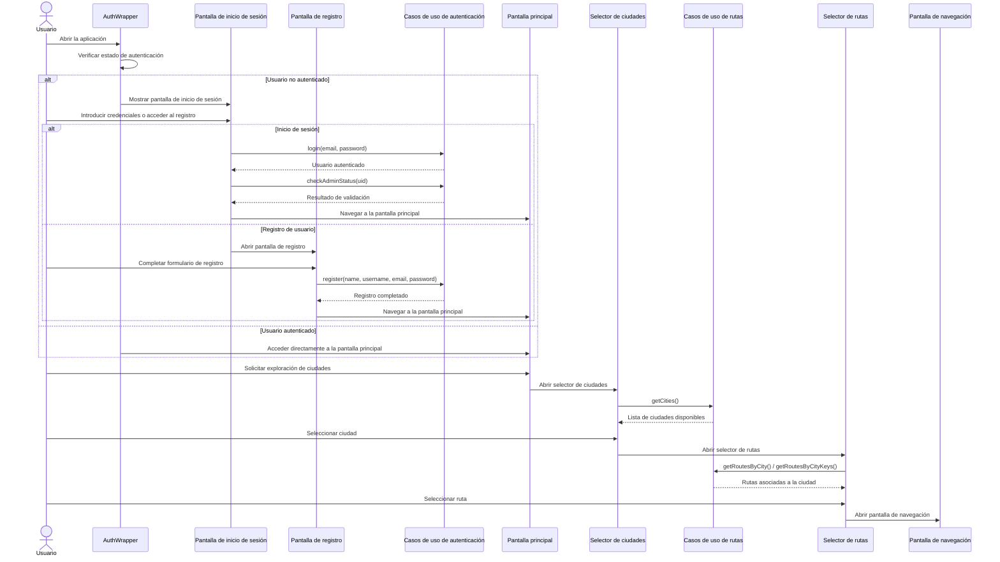
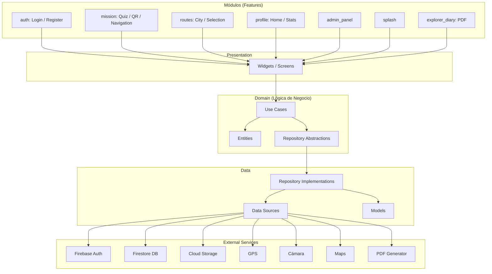
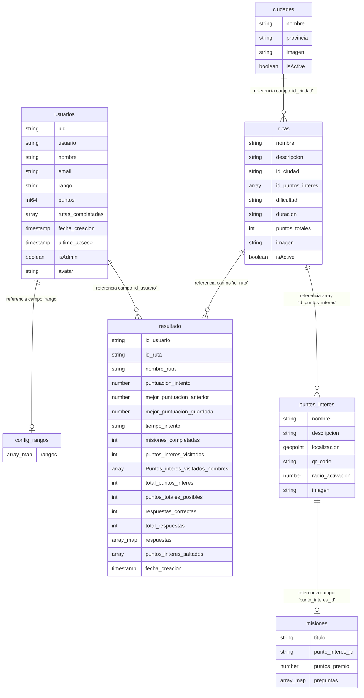
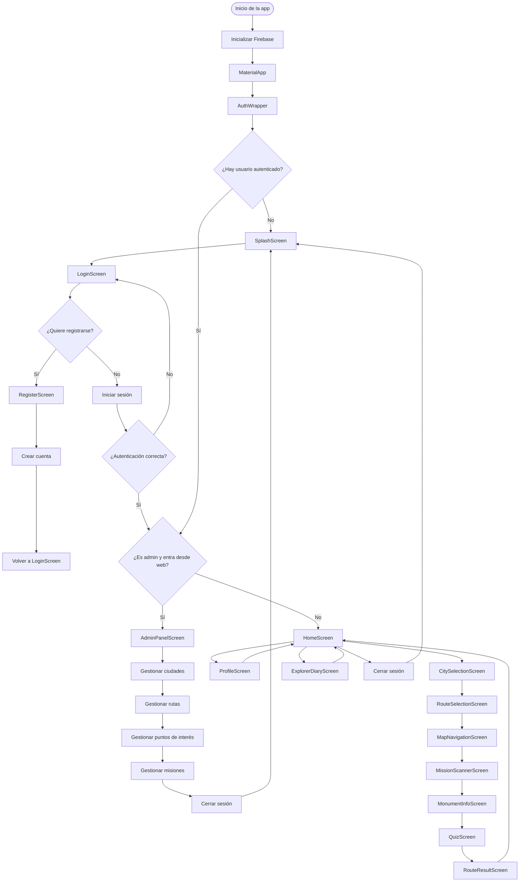
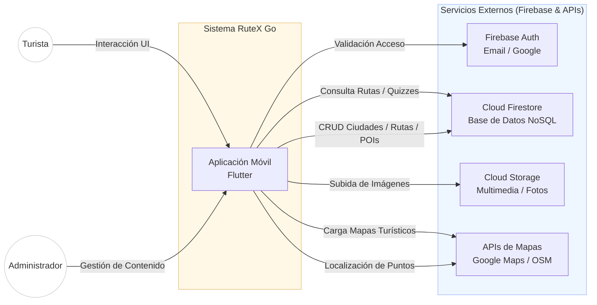
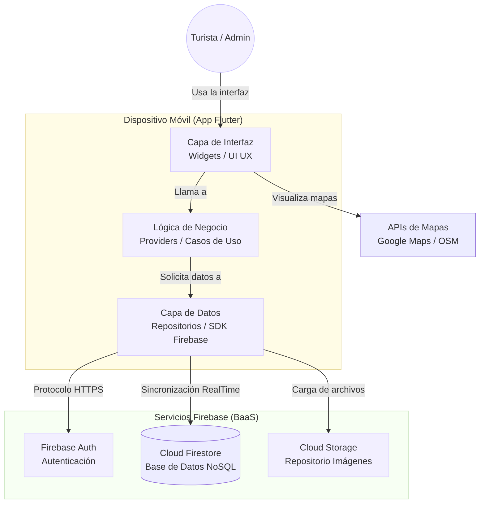

---



---



---

```mermaid
flowchart TD
  %% --- INICIO / AUTH ---
  A([INICIO: Iniciar aplicación])
  B[Inicializar Firebase]
  C[Verificar sesión de usuario]
  D{¿Hay usuario autenticado?}
  E[Mostrar pantalla Splash/Login]
  F{¿Usuario quiere registrarse?}
  G[Mostrar opciones de login: Iniciar sesión con email/contraseña, Iniciar sesión con Google, Recuperar contraseña]
  H{¿Autenticación exitosa?}
  I[Mostrar error]

  %% --- REGISTRO ---
  subgraph REG["Pantalla de Registro"]
    R1[Ingresar datos (nombre, usuario, email, contraseña)]
    R2[Guardar en Firebase]
    R3[Ir a Login]
    R1 --> R2 --> R3
  end

  %% --- DECISIÓN DE ROL ---
  J{¿Es usuario web y es administrador?}
  K[Pantalla de Panel de Administración]

  %% --- ADMIN ---
  L{¿Qué desea gestionar?}
  M[Ciudades (CRUD)]
  N[Rutas (CRUD)]
  O[Puntos de interés (CRUD)]
  P[Misiones (CRUD)]
  Q[Realizar operación]
  S[Guardar cambios en Firestore/Storage]
  T[Volver a seleccionar opción o cerrar sesión]

  %% --- HOME / USUARIO FINAL ---
  U[Pantalla Home]

  subgraph OPCIONES["Opciones de Usuario"]
    O1[Opción 1: Ver perfil. Cargar datos del usuario. Mostrar información personal. Opción para actualizar nombre/avatar]
    O2[Opción 2: Explorar rutas. Seleccionar ciudad. Ver rutas disponibles de esa ciudad. Seleccionar una ruta. Ver detalles y disponibilidad de la ruta. Opción para iniciar misión]
    O3[Opción 3: Realizar misión. Ir a escanear QR. Escanear código QR del punto de interés. Validar que es el punto correcto. Mostrar información del monumento. Completar misión/reto. Hacer quiz si aplica. Guardar progreso en Firestore]
    O4[Opción 4: Ver diario del explorador. Cargar rutas completadas. Seleccionar rutas para incluir en diario. Añadir fotos a cada ruta. Vista previa del diario. Generar y descargar PDF]
    O5[Opción 5: Cerrar sesión]
  end

  X[Cerrar sesión]
  Y[Volver a Splash/Login]

  %% --- CONEXIONES PRINCIPALES ---
  A --> B --> C --> D
  D -- Sí --> J
  D -- No --> E
  E --> F
  F -- Sí --> R1
  F -- No --> G
  G --> H
  H -- Sí --> J
  H -- No --> I

  %% --- ADMIN FLUJO ---
  J -- Sí --> K
  K --> L
  L --> M
  L --> N
  L --> O
  L --> P
  M --> Q
  N --> Q
  O --> Q
  P --> Q
  Q --> S --> T
  T --> K
  T --> O5

  %% --- USUARIO NORMAL ---
  J -- No --> U
  U --> O1
  U --> O2
  U --> O3
  U --> O4
  U --> O5
  O5 --> X --> Y
```
