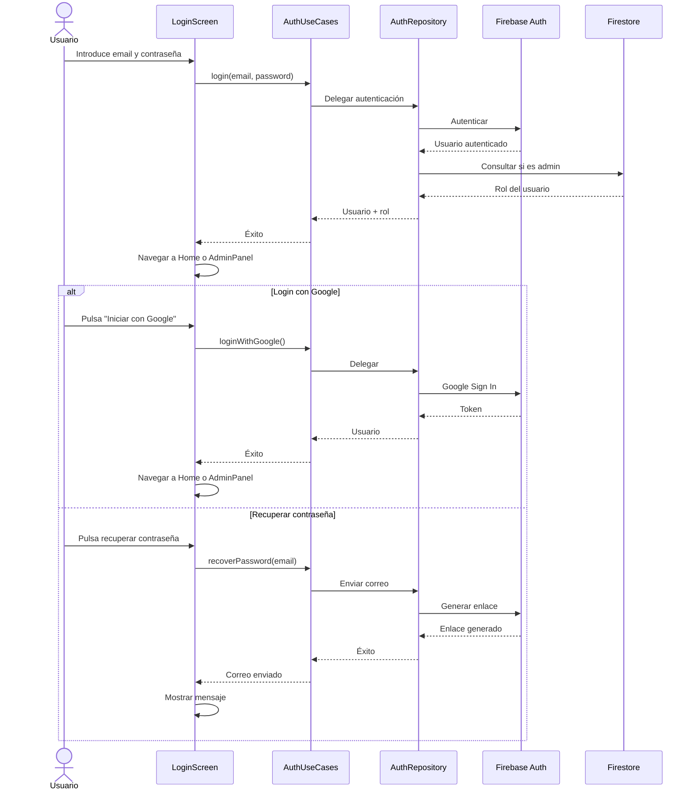
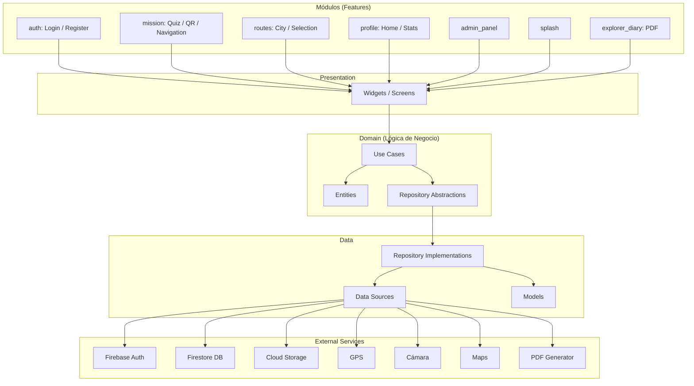
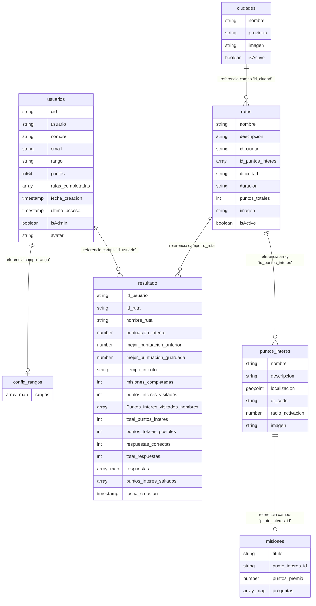
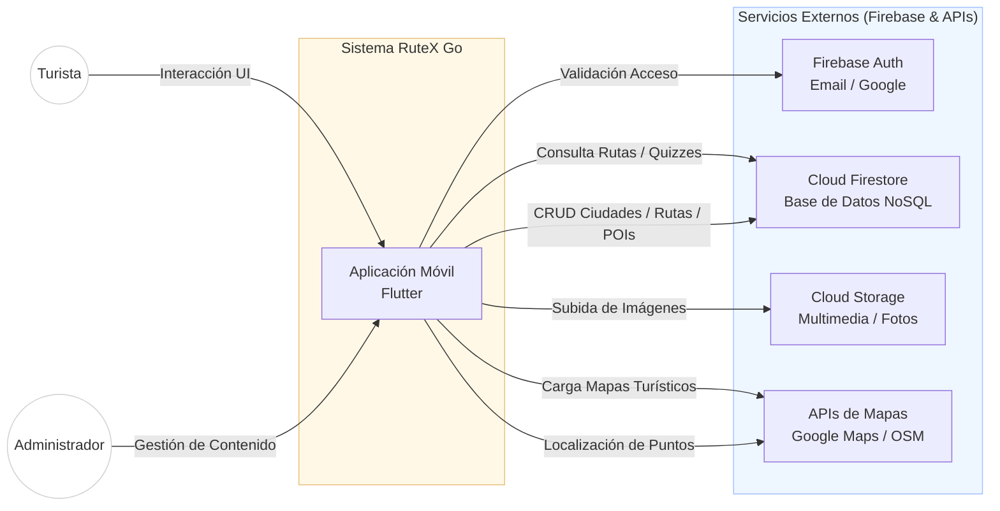
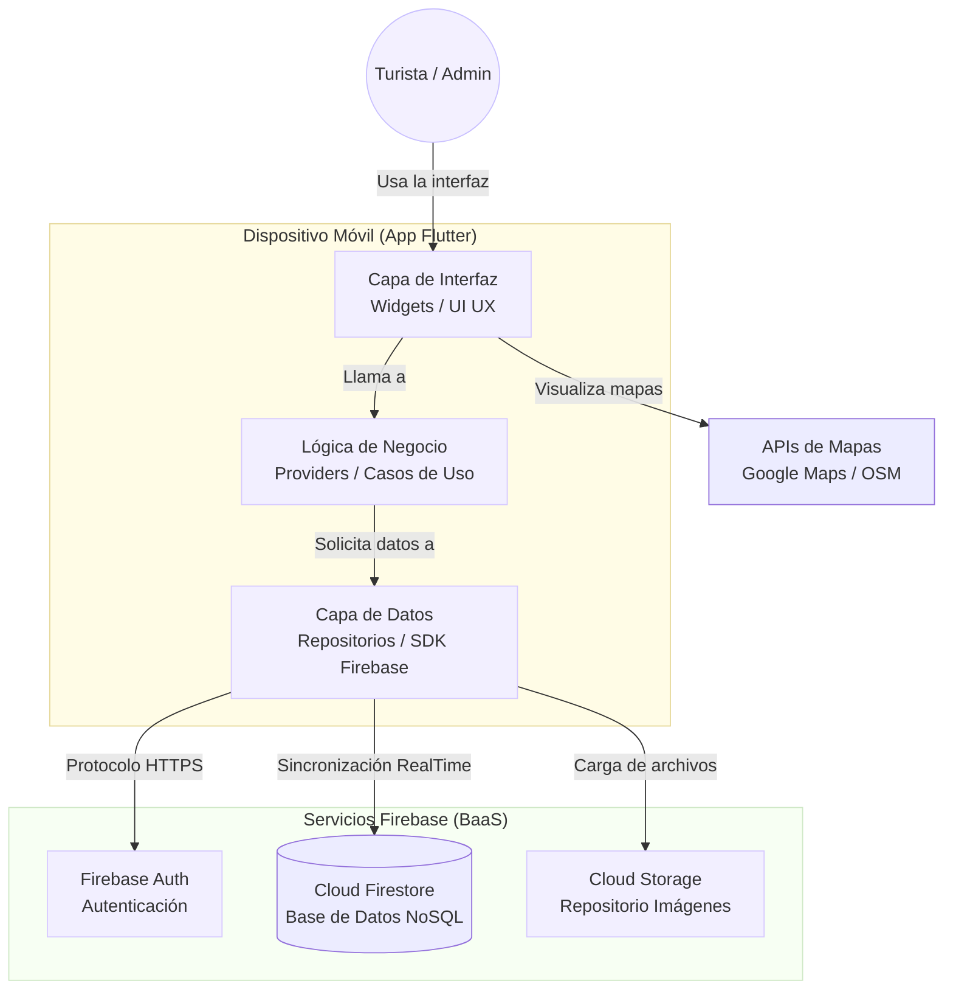

```mermaid
sequenceDiagram
    actor Usuario
    participant LoginScreen
    participant AuthUseCases
    participant AuthRepository
    participant Firebase Auth
    participant Firestore

    Usuario->>LoginScreen: Introduce email y contraseña
    LoginScreen->>AuthUseCases: login(email, password)
    AuthUseCases->>AuthRepository: Delegar autenticación
    AuthRepository->>Firebase Auth: Autenticar
    Firebase Auth-->>AuthRepository: Usuario autenticado
    AuthRepository->>Firestore: Consultar si es admin
    Firestore-->>AuthRepository: Rol del usuario
    AuthRepository-->>AuthUseCases: Usuario + rol
    AuthUseCases-->>LoginScreen: Éxito
    LoginScreen->>LoginScreen: Navegar a Home o AdminPanel

    alt Login con Google
        Usuario->>LoginScreen: Pulsa "Iniciar con Google"
        LoginScreen->>AuthUseCases: loginWithGoogle()
        AuthUseCases->>AuthRepository: Delegar
        AuthRepository->>Firebase Auth: Google Sign In
        Firebase Auth-->>AuthRepository: Token
        AuthRepository-->>AuthUseCases: Usuario
        AuthUseCases-->>LoginScreen: Éxito
        LoginScreen->>LoginScreen: Navegar a Home o AdminPanel
    else Recuperar contraseña
        Usuario->>LoginScreen: Pulsa recuperar contraseña
        LoginScreen->>AuthUseCases: recoverPassword(email)
        AuthUseCases->>AuthRepository: Enviar correo
        AuthRepository->>Firebase Auth: Generar enlace
        Firebase Auth-->>AuthRepository: Enlace generado
        AuthRepository-->>AuthUseCases: Éxito
        AuthUseCases-->>LoginScreen: Correo enviado
        LoginScreen->>LoginScreen: Mostrar mensaje
    end
```

```mermaid
flowchart TD
    %% Módulos principales (Features)
    subgraph Features["Módulos (Features)"]
        direction LR
        F1[auth: Login / Register]
        F2[mission: Quiz / QR / Navigation]
        F3[routes: City / Selection]
        F4[profile: Home / Stats]
        F5[admin_panel]
        F6[splash]
        F7[explorer_diary: PDF]
    end

    %% Capas de Clean Architecture
    subgraph Presentation["Presentation"]
        direction TB
        P1[Widgets / Screens]
    end

    subgraph Domain["Domain (Lógica de Negocio)"]
        direction TB
        D1[Use Cases]
        D2[Entities]
        D3[Repository Abstractions]
    end

    subgraph Data["Data"]
        direction TB
        DA1[Repository Implementations]
        DA2[Data Sources]
        DA3[Models]
    end

    %% Servicios externos
    subgraph External["External Services"]
        direction LR
        E1[Firebase Auth]
        E2[Firestore DB]
        E3[Cloud Storage]
        E4[GPS]
        E5[Cámara]
        E6[Maps]
        E7[PDF Generator]
    end

    %% Relaciones entre módulos y capas
    F1 --> P1
    F2 --> P1
    F3 --> P1
    F4 --> P1
    F5 --> P1
    F6 --> P1
    F7 --> P1

    P1 --> D1
    D1 --> D2
    D1 --> D3
    D3 --> DA1
    DA1 --> DA2
    DA1 --> DA3

    %% Relación de Data con servicios externos
    DA2 --> E1
    DA2 --> E2
    DA2 --> E3
    DA2 --> E4
    DA2 --> E5
    DA2 --> E6
    DA2 --> E7
```

```mermaid
erDiagram
    usuarios ||--o| config_rangos : "referencia campo 'rango'"
    usuarios ||--o{ resultado : "referencia campo 'id_usuario'"
    ciudades ||--o{ rutas : "referencia campo 'id_ciudad'"
    rutas ||--o{ puntos_interes : "referencia array 'id_puntos_interes'"
    puntos_interes ||--o| misiones : "referencia campo 'punto_interes_id'"
    rutas ||--o{ resultado : "referencia campo 'id_ruta'"

    usuarios {
        string uid
        string usuario
        string nombre
        string email
        string rango
        int64 puntos
        array rutas_completadas
        timestamp fecha_creacion
        timestamp ultimo_acceso
        boolean isAdmin
        string avatar
    }

    ciudades {
        string nombre
        string provincia
        string imagen
        boolean isActive
    }

    rutas {
        string nombre
        string descripcion
        string id_ciudad
        array id_puntos_interes
        string dificultad
        string duracion
        int puntos_totales
        string imagen
        boolean isActive
    }

    puntos_interes {
        string nombre
        string descripcion
        geopoint localizacion
        string qr_code
        number radio_activacion
        string imagen
    }

    misiones {
        string titulo
        string punto_interes_id
        number puntos_premio
        array_map preguntas
    }

    resultado {
        string id_usuario
        string id_ruta
        string nombre_ruta
        number puntuacion_intento
        number mejor_puntuacion_anterior
        number mejor_puntuacion_guardada
        string tiempo_intento
        int misiones_completadas
        int puntos_interes_visitados
        array Puntos_interes_visitados_nombres
        int total_puntos_interes
        int puntos_totales_posibles
        int respuestas_correctas
        int total_respuestas
        array_map respuestas
        array puntos_interes_saltados
        timestamp fecha_creacion
    }

    config_rangos {
        array_map rangos
    }
```

```mermaid
flowchart TD
    A([Inicio de la app]) --> B[Inicializar Firebase]
    B --> C[MaterialApp]
    C --> D[AuthWrapper]

    D --> E{¿Hay usuario autenticado?}

    E -- No --> F[SplashScreen]
    F --> G[LoginScreen]
    G --> H{¿Quiere registrarse?}

    H -- Sí --> I[RegisterScreen]
    I --> J[Crear cuenta]
    J --> K[Volver a LoginScreen]

    H -- No --> L[Iniciar sesión]
    L --> M{¿Autenticación correcta?}
    M -- No --> G
    M -- Sí --> N{¿Es admin y entra desde web?}

    E -- Sí --> N

    N -- Sí --> O[AdminPanelScreen]
    O --> P[Gestionar ciudades]
    P --> Q[Gestionar rutas]
    Q --> R[Gestionar puntos de interés]
    R --> S[Gestionar misiones]
    S --> T[Cerrar sesión]
    T --> F

    N -- No --> U[HomeScreen]

    U --> V[ProfileScreen]
    V --> U

    U --> W[CitySelectionScreen]
    W --> X[RouteSelectionScreen]
    X --> Y[MapNavigationScreen]
    Y --> Z[MissionScannerScreen]
    Z --> AA[MonumentInfoScreen]
    AA --> AB[QuizScreen]
    AB --> AC[RouteResultScreen]
    AC --> U

    U --> AD[ExplorerDiaryScreen]
    AD --> U

    U --> AE[Cerrar sesión]
    AE --> F
```

---

```mermaid
flowchart LR
  %% Agrupaciones
  subgraph Sistema_RuteX_Go["Sistema RuteX Go"]
    style Sistema_RuteX_Go fill:#fff8e6,stroke:#e6c07a,stroke-width:1px
    app["Aplicación Móvil<br/>Flutter"]
  end

  subgraph Servicios_Externos["Servicios Externos (Firebase & APIs)"]
    style Servicios_Externos fill:#eef6ff,stroke:#9fbfff,stroke-width:1px
    auth["Firebase Auth<br/>Email / Google"]
    firestore["Cloud Firestore<br/>Base de Datos NoSQL"]
    storage["Cloud Storage<br/>Multimedia / Fotos"]
    maps["APIs de Mapas<br/>Google Maps / OSM"]
  end

  %% Actores
  Turista((Turista))
  Administrador((Administrador))

  %% Relaciones actor -> sistema
  Turista -- "Interacción UI" --> app
  Administrador -- "Gestión de Contenido" --> app

  %% Relaciones app -> servicios externos (con etiquetas)
  app -- "Validación Acceso" --> auth
  app -- "Consulta Rutas / Quizzes" --> firestore
  app -- "CRUD Ciudades / Rutas / POIs" --> firestore
  app -- "Subida de Imágenes" --> storage
  app -- "Carga Mapas Turísticos" --> maps
  app -- "Localización de Puntos" --> maps

  %% Alineación sugerida
  classDef actor fill:#ffffff,stroke:#cfcfcf;
  class Turista,Administrador actor;
```

---

```mermaid
flowchart TB
  %% Actor superior
  actor((Turista / Admin))

  %% Dispositivo móvil (contenedor)
  subgraph Dispositivo_Móvil["Dispositivo Móvil (App Flutter)"]
    style Dispositivo_Móvil fill:#fffce6,stroke:#e6d89a,stroke-width:1px
    UI["Capa de Interfaz<br/>Widgets / UI UX"]
    Logic["Lógica de Negocio<br/>Providers / Casos de Uso"]
    Data["Capa de Datos<br/>Repositorios / SDK Firebase"]
  end

  %% APIs de mapas (a la derecha)
  Maps["APIs de Mapas<br/>Google Maps / OSM"]

  %% Servicios Firebase (contenedor inferior)
  subgraph Servicios_Firebase["Servicios Firebase (BaaS)"]
    style Servicios_Firebase fill:#f7fff3,stroke:#cfe8c6,stroke-width:1px
    Auth["Firebase Auth<br/>Autenticación"]
    Firestore[(Cloud Firestore<br/>Base de Datos NoSQL)]
    Storage["Cloud Storage<br/>Repositorio Imágenes"]
  end

  %% Conexiones principales
  actor -->|Usa la interfaz| UI
  UI -->|Llama a| Logic
  Logic -->|Solicita datos a| Data
  UI -->|Visualiza mapas| Maps

  %% Conexiones desde capa de datos a servicios
  Data -->|Protocolo HTTPS| Auth
  Data -->|Sincronización RealTime| Firestore
  Data -->|Carga de archivos| Storage

  %% Estilos de nodos
  classDef actorStyle fill:#f3f0ff,stroke:#c8bfff,stroke-width:1px;
  classDef boxStyle fill:#f2efff,stroke:#d6c9ff,stroke-width:1px;
  class actor actorStyle;
  class UI,Logic,Data,Auth,Storage boxStyle;
```

---

```mermaid
graph TD
    %% ----------------------------------------------------
    %% CONFIGURACIÓN DE ESTILOS (Idénticos al original)
    %% ----------------------------------------------------
    classDef default fill:#ffffff,stroke:#333333,stroke-width:1.5px;
    classDef decision fill:#ffffff,stroke:#e06666,stroke-width:2px;
    classDef inicio fill:#ffffff,stroke:#333333,stroke-width:1.5px;
    classDef opcion fill:#fff2cc,stroke:#d6b656,stroke-width:1.5px;

    %% Remover bordes y fondos de los contenedores para que sean invisibles
    style Bloque_Autenticacion fill:none,stroke:none;
    style Bloque_Admin fill:none,stroke:none;
    style Bloque_Home fill:none,stroke:none;

    %% ====================================================
    %% ESTRUCTURA DE 3 COLUMNAS PRINCIPALES
    %% ====================================================
    
    %% --- COLUMNA 1: AUTENTICACIÓN (Izquierda - Flujo Vertical) ---
    subgraph Bloque_Autenticacion [" "]
        direction TB
        INICIO([INICIO:<br>Iniciar aplicación]) --> InitFirebase[Inicializar Firebase]
        InitFirebase --> CheckSession[Verificar sesión de<br>usuario]
        CheckSession --> IsAuth{¿Hay usuario<br>autenticado?}
        
        IsAuth -- NO --> SplashLogin[Mostrar pantalla<br>Splash/Login]
        SplashLogin --> WantRegister{¿Usuario quiere<br>registrarse?}
        
        WantRegister -- NO --> LoginOptions["Mostrar opciones de login:<br>- Iniciar sesión con email/contraseña<br>- Iniciar sesión con Google<br>- Recuperar contraseña"]
        LoginOptions --> AuthSuccess{¿Autenticación<br>exitosa?}
        AuthSuccess -- NO --> ShowError[Mostrar error]
        
        %% Sub-flujo de Registro
        WantRegister -- SÍ --> PantallaRegistro["<b>Pantalla de Registro</b><br><br>Ingresar datos (nombre,<br>usuario, email, contraseña)"]
        PantallaRegistro --> SaveFirebase[Guardar en Firebase]
        SaveFirebase --> GoToLogin[Ir a Login]
        GoToLogin --> LoginOptions
    end

    %% --- COLUMNA 2: ADMINISTRACIÓN (Centro - Flujo Vertical) ---
    subgraph Bloque_Admin [" "]
        direction TB
        IsAdmin{¿Es usuario web Y<br>es administrador?} -- SÍ --> AdminPanel[Pantalla de Panel de<br>Administración]
        AdminPanel --> WhatManage{¿Qué desea<br>gestionar?}
        
        WhatManage --> Ciudades["Ciudades<br>(CRUD)"]
        WhatManage --> Rutas["Rutas<br>(CRUD)"]
        WhatManage --> POI["Puntos de<br>interés (CRUD)"]
        WhatManage --> Misiones["Misiones<br>(CRUD)"]
        
        Ciudades --> DoOp[Realizar operación]
        Rutas --> DoOp
        POI --> DoOp
        Misiones --> DoOp
        
        DoOp --> SaveFirestore[Guardar cambios en<br>Firestore/Storage]
        SaveFirestore --> LoopAdmin[Volver a seleccionar<br>opción o cerrar sesión]
        LoopAdmin --> AdminPanel
    end

    %% --- COLUMNA 3: HOME Y OPCIONES (Derecha - Flujo Vertical) ---
    subgraph Bloque_Home [" "]
        direction TB
        Home[Pantalla Home] --> Op1["<b>Opción 1: Ver perfil</b><br><br>Cargar datos del usuario<br>Mostrar información personal<br>Opción para actualizar nombre/avatar"]
        Home --> Op2["<b>Opción 2: Explorar rutas</b><br><br>Seleccionar ciudad<br>Ver rutas disponibles de esa ciudad<br>Seleccionar una ruta<br>Ver detalles y disponibilidad de la ruta<br>Opción para iniciar misión"]
        Home --> Op3["<b>Opción 3: Realizar misión</b><br><br>Ir a escáner QR<br>Escanear código QR del punto de interés<br>Validar que es el punto correcto<br>Mostrar información del monumento<br>Completar misión/reto<br>Hacer quiz si aplica<br>Guardar progreso en Firestore"]
        Home --> Op4["<b>Opción 4: Ver diario del explorador</b><br><br>Cargar rutas completadas<br>Seleccionar rutas para incluir en diario<br>Añadir fotos a cada ruta<br>Vista previa del diario<br>Generar y descargar PDF"]
        Home --> Op5[Opción 5: Cerrar sesión]
        
        Op5 --> Logout[Cerrar sesión]
        Logout --> ReturnSplash[Volver a Splash/Login]
    end

    %% ====================================================
    %% CONEXIONES INTER-COLUMNAS (Cruces horizontales del PDF)
    %% ====================================================
    IsAuth -- SÍ --> IsAdmin
    AuthSuccess -- SÍ --> IsAdmin
    IsAdmin -- NO --> Home
    LoopAdmin --> AdminPanel
    LoopAdmin --> Home
    ReturnSplash --> SplashLogin

    %% Retornos de las opciones de vuelta a sus flujos correspondientes
    Op1 --> Home
    Op2 --> Home
    Op3 --> Home
    Op4 --> Home

    %% ====================================================
    %% ASIGNACIÓN DE ESTILOS
    %% ====================================================
    class IsAuth,WantRegister,AuthSuccess,IsAdmin,WhatManage decision;
    class INICIO inicio;
    class Op5 opcion;
```
