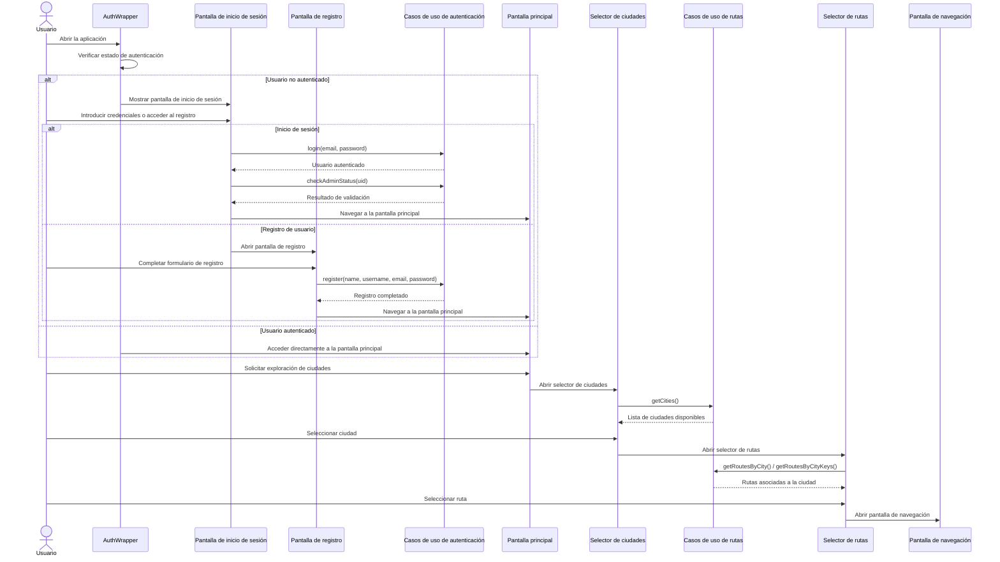
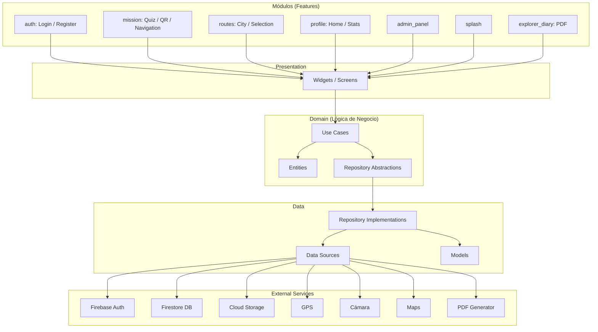
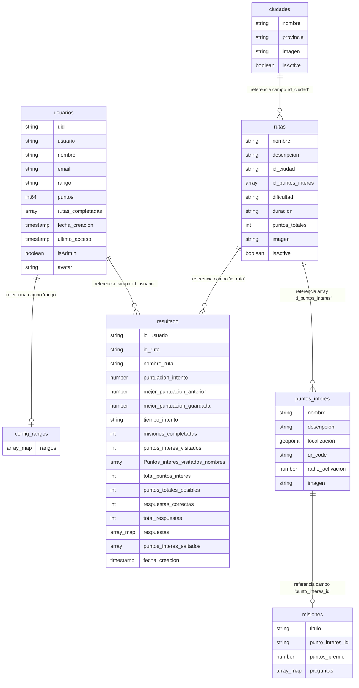
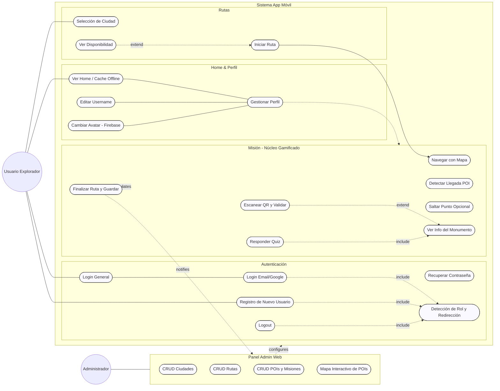

```mermaid
sequenceDiagram
    actor Usuario
    participant AuthWrapper
    participant LoginScreen as Pantalla de inicio de sesión
    participant RegisterScreen as Pantalla de registro
    participant AuthUseCases as Casos de uso de autenticación
    participant HomeScreen as Pantalla principal
    participant CitySelectionScreen as Selector de ciudades
    participant RoutesUseCases as Casos de uso de rutas
    participant RouteSelectionScreen as Selector de rutas
    participant MapNavigationScreen as Pantalla de navegación

    Usuario->>AuthWrapper: Abrir la aplicación
    AuthWrapper->>AuthWrapper: Verificar estado de autenticación

    alt Usuario no autenticado
        AuthWrapper->>LoginScreen: Mostrar pantalla de inicio de sesión
        Usuario->>LoginScreen: Introducir credenciales o acceder al registro

        alt Inicio de sesión
            LoginScreen->>AuthUseCases: login(email, password)
            AuthUseCases-->>LoginScreen: Usuario autenticado
            LoginScreen->>AuthUseCases: checkAdminStatus(uid)
            AuthUseCases-->>LoginScreen: Resultado de validación
            LoginScreen->>HomeScreen: Navegar a la pantalla principal
        else Registro de usuario
            LoginScreen->>RegisterScreen: Abrir pantalla de registro
            Usuario->>RegisterScreen: Completar formulario de registro
            RegisterScreen->>AuthUseCases: register(name, username, email, password)
            AuthUseCases-->>RegisterScreen: Registro completado
            RegisterScreen->>HomeScreen: Navegar a la pantalla principal
        end
    else Usuario autenticado
        AuthWrapper->>HomeScreen: Acceder directamente a la pantalla principal
    end

    Usuario->>HomeScreen: Solicitar exploración de ciudades
    HomeScreen->>CitySelectionScreen: Abrir selector de ciudades
    CitySelectionScreen->>RoutesUseCases: getCities()
    RoutesUseCases-->>CitySelectionScreen: Lista de ciudades disponibles

    Usuario->>CitySelectionScreen: Seleccionar ciudad
    CitySelectionScreen->>RouteSelectionScreen: Abrir selector de rutas
    RouteSelectionScreen->>RoutesUseCases: getRoutesByCity() / getRoutesByCityKeys()
    RoutesUseCases-->>RouteSelectionScreen: Rutas asociadas a la ciudad

    Usuario->>RouteSelectionScreen: Seleccionar ruta
    RouteSelectionScreen->>MapNavigationScreen: Abrir pantalla de navegación
```

```mermaid
flowchart TD
    %% Módulos principales (Features)
    subgraph Features["Módulos (Features)"]
        direction LR
        F1[auth: Login / Register]
        F2[mission: Quiz / QR / Navigation]
        F3[routes: City / Selection]
        F4[profile: Home / Stats]
        F5[admin_panel]
        F6[splash]
        F7[explorer_diary: PDF]
    end

    %% Capas de Clean Architecture
    subgraph Presentation["Presentation"]
        direction TB
        P1[Widgets / Screens]
    end

    subgraph Domain["Domain (Lógica de Negocio)"]
        direction TB
        D1[Use Cases]
        D2[Entities]
        D3[Repository Abstractions]
    end

    subgraph Data["Data"]
        direction TB
        DA1[Repository Implementations]
        DA2[Data Sources]
        DA3[Models]
    end

    %% Servicios externos
    subgraph External["External Services"]
        direction LR
        E1[Firebase Auth]
        E2[Firestore DB]
        E3[Cloud Storage]
        E4[GPS]
        E5[Cámara]
        E6[Maps]
        E7[PDF Generator]
    end

    %% Relaciones entre módulos y capas
    F1 --> P1
    F2 --> P1
    F3 --> P1
    F4 --> P1
    F5 --> P1
    F6 --> P1
    F7 --> P1

    P1 --> D1
    D1 --> D2
    D1 --> D3
    D3 --> DA1
    DA1 --> DA2
    DA1 --> DA3

    %% Relación de Data con servicios externos
    DA2 --> E1
    DA2 --> E2
    DA2 --> E3
    DA2 --> E4
    DA2 --> E5
    DA2 --> E6
    DA2 --> E7
```

```mermaid
erDiagram
    usuarios ||--o| config_rangos : "referencia campo 'rango'"
    usuarios ||--o{ resultado : "referencia campo 'id_usuario'"
    ciudades ||--o{ rutas : "referencia campo 'id_ciudad'"
    rutas ||--o{ puntos_interes : "referencia array 'id_puntos_interes'"
    puntos_interes ||--o| misiones : "referencia campo 'punto_interes_id'"
    rutas ||--o{ resultado : "referencia campo 'id_ruta'"

    usuarios {
        string uid
        string usuario
        string nombre
        string email
        string rango
        int64 puntos
        array rutas_completadas
        timestamp fecha_creacion
        timestamp ultimo_acceso
        boolean isAdmin
        string avatar
    }

    ciudades {
        string nombre
        string provincia
        string imagen
        boolean isActive
    }

    rutas {
        string nombre
        string descripcion
        string id_ciudad
        array id_puntos_interes
        string dificultad
        string duracion
        int puntos_totales
        string imagen
        boolean isActive
    }

    puntos_interes {
        string nombre
        string descripcion
        geopoint localizacion
        string qr_code
        number radio_activacion
        string imagen
    }

    misiones {
        string titulo
        string punto_interes_id
        number puntos_premio
        array_map preguntas
    }

    resultado {
        string id_usuario
        string id_ruta
        string nombre_ruta
        number puntuacion_intento
        number mejor_puntuacion_anterior
        number mejor_puntuacion_guardada
        string tiempo_intento
        int misiones_completadas
        int puntos_interes_visitados
        array Puntos_interes_visitados_nombres
        int total_puntos_interes
        int puntos_totales_posibles
        int respuestas_correctas
        int total_respuestas
        array_map respuestas
        array puntos_interes_saltados
        timestamp fecha_creacion
    }

    config_rangos {
        array_map rangos
    }
```

```mermaid
flowchart LR
    %% Actores con forma de círculo
    User((Usuario Explorador))
    Admin((Administrador))

    subgraph App [Sistema App Móvil]
        direction TB
        
        subgraph Auth [Autenticación]
            direction LR
            L1([Login General]) --- L2([Login Email/Google])
            R1([Registro de Nuevo Usuario])
            C1([Recuperar Contraseña])
            Out([Logout])
            Det([Detección de Rol y Redirección])
            
            L2 -.->|include| Det
            R1 -.->|include| Det
            Out -.->|include| Det
        end

        subgraph Perfil [Home & Perfil]
            H1([Ver Home / Cache Offline])
            E1([Editar Username])
            A1([Cambiar Avatar - Firebase])
            G1([Gestionar Perfil])
            
            H1 --- G1
            E1 --- G1
            A1 --- G1
        end

        subgraph Rutas [Rutas]
            S1([Selección de Ciudad])
            V1([Ver Disponibilidad])
            I1([Iniciar Ruta])
            V1 -.->|extend| I1
        end

        subgraph Mision [Misión - Núcleo Gamificado]
            M1([Navegar con Mapa])
            M2([Detectar Llegada POI])
            M3([Escanear QR y Validar])
            M4([Responder Quiz])
            M5([Saltar Punto Opcional])
            M6([Finalizar Ruta y Guardar])
            Info([Ver Info del Monumento])
            
            M3 -.->|extend| Info
            M4 -.->|include| Info
        end
    end

    subgraph Web [Panel Admin Web]
        W1([CRUD Ciudades])
        W2([CRUD Rutas])
        W3([CRUD POIs y Misiones])
        W4([Mapa Interactivo de POIs])
    end

    %% Conexiones principales
    User --- L1
    User --- R1
    User --- S1
    User --- H1
    
    Admin --- Web
    
    %% Relaciones entre bloques
    G1 -.-> Mision
    I1 --> M1
    M6 -.->|notifies| Web
    M6 -.->|populates| App
    Web -.->|configures| App

    %% Estilos para que se parezca más
    classDef usecase fill:#f9f9ff,stroke:#333,stroke-width:1px,rx:20,ry:20
    class L1,L2,R1,C1,Out,Det,H1,E1,A1,G1,S1,V1,I1,M1,M2,M3,M4,M5,M6,Info,W1,W2,W3,W4 usecase
```
