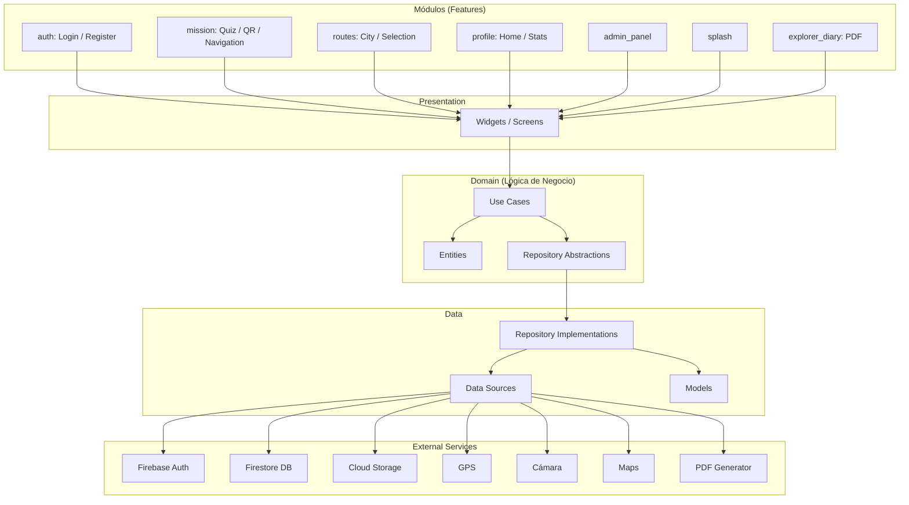
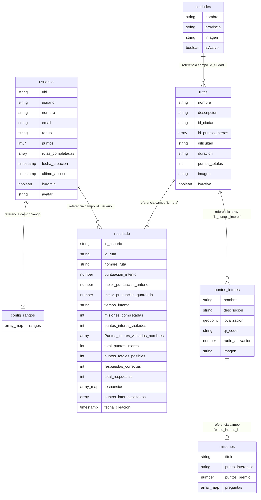
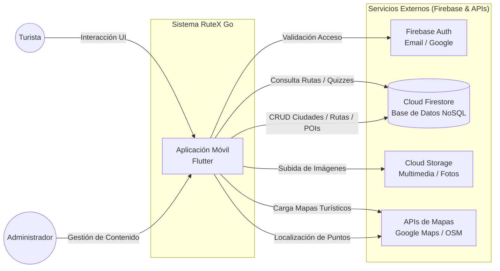
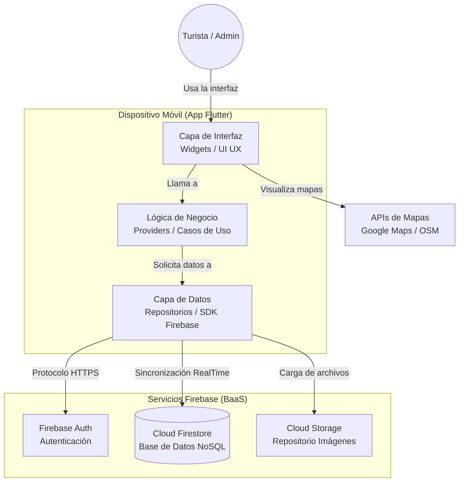
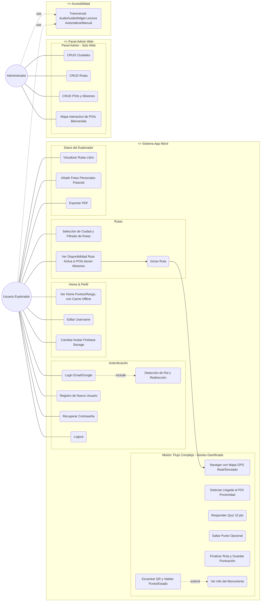

```mermaid
flowchart TD
    %% Módulos principales (Features)
    subgraph Features["Módulos (Features)"]
        direction LR
        F1[auth: Login / Register]
        F2[mission: Quiz / QR / Navigation]
        F3[routes: City / Selection]
        F4[profile: Home / Stats]
        F5[admin_panel]
        F6[splash]
        F7[explorer_diary: PDF]
    end

    %% Capas de Clean Architecture
    subgraph Presentation["Presentation"]
        direction TB
        P1[Widgets / Screens]
    end

    subgraph Domain["Domain (Lógica de Negocio)"]
        direction TB
        D1[Use Cases]
        D2[Entities]
        D3[Repository Abstractions]
    end

    subgraph Data["Data"]
        direction TB
        DA1[Repository Implementations]
        DA2[Data Sources]
        DA3[Models]
    end

    %% Servicios externos
    subgraph External["External Services"]
        direction LR
        E1[Firebase Auth]
        E2[Firestore DB]
        E3[Cloud Storage]
        E4[GPS]
        E5[Cámara]
        E6[Maps]
        E7[PDF Generator]
    end

    %% Relaciones entre módulos y capas
    F1 --> P1
    F2 --> P1
    F3 --> P1
    F4 --> P1
    F5 --> P1
    F6 --> P1
    F7 --> P1

    P1 --> D1
    D1 --> D2
    D1 --> D3
    D3 --> DA1
    DA1 --> DA2
    DA1 --> DA3

    %% Relación de Data con servicios externos
    DA2 --> E1
    DA2 --> E2
    DA2 --> E3
    DA2 --> E4
    DA2 --> E5
    DA2 --> E6
    DA2 --> E7
```

```mermaid
erDiagram
    usuarios ||--o| config_rangos : "referencia campo 'rango'"
    usuarios ||--o{ resultado : "referencia campo 'id_usuario'"
    ciudades ||--o{ rutas : "referencia campo 'id_ciudad'"
    rutas ||--o{ puntos_interes : "referencia array 'id_puntos_interes'"
    puntos_interes ||--o| misiones : "referencia campo 'punto_interes_id'"
    rutas ||--o{ resultado : "referencia campo 'id_ruta'"

    usuarios {
        string uid
        string usuario
        string nombre
        string email
        string rango
        int64 puntos
        array rutas_completadas
        timestamp fecha_creacion
        timestamp ultimo_acceso
        boolean isAdmin
        string avatar
    }

    ciudades {
        string nombre
        string provincia
        string imagen
        boolean isActive
    }

    rutas {
        string nombre
        string descripcion
        string id_ciudad
        array id_puntos_interes
        string dificultad
        string duracion
        int puntos_totales
        string imagen
        boolean isActive
    }

    puntos_interes {
        string nombre
        string descripcion
        geopoint localizacion
        string qr_code
        number radio_activacion
        string imagen
    }

    misiones {
        string titulo
        string punto_interes_id
        number puntos_premio
        array_map preguntas
    }

    resultado {
        string id_usuario
        string id_ruta
        string nombre_ruta
        number puntuacion_intento
        number mejor_puntuacion_anterior
        number mejor_puntuacion_guardada
        string tiempo_intento
        int misiones_completadas
        int puntos_interes_visitados
        array Puntos_interes_visitados_nombres
        int total_puntos_interes
        int puntos_totales_posibles
        int respuestas_correctas
        int total_respuestas
        array_map respuestas
        array puntos_interes_saltados
        timestamp fecha_creacion
    }

    config_rangos {
        array_map rangos
    }
```

```mermaid
graph LR
    %% Actores
    U1((Turista))
    U2((Administrador))

    %% Sistema Central
    subgraph "Sistema RuteX Go"
        App[Aplicación Móvil<br/>Flutter]
    end

    %% Servicios Externos
    subgraph "Servicios Externos (Firebase & APIs)"
        Auth[Firebase Auth<br/>Email / Google]
        Firestore[(Cloud Firestore<br/>Base de Datos NoSQL)]
        Storage[Cloud Storage<br/>Multimedia / Fotos]
        Maps[APIs de Mapas<br/>Google Maps / OSM]
    end

    %% Flujo de interacciones del Turista
    U1 -- "Interacción UI" --> App
    App -- "Validación Acceso" --> Auth
    App -- "Consulta Rutas / Quizzes" --> Firestore
    App -- "Carga Mapas Turísticos" --> Maps

    %% Flujo de interacciones del Admin
    U2 -- "Gestión de Contenido" --> App
    App -- "CRUD Ciudades / Rutas / POIs" --> Firestore
    App -- "Subida de Imágenes" --> Storage
    App -- "Localización de Puntos" --> Maps
```

```mermaid
graph TB
    %% Actores
    User((Turista / Admin))

    %% Contenedor Aplicación Móvil
    subgraph "Dispositivo Móvil (App Flutter)"
        UI[Capa de Interfaz<br/>Widgets / UI UX]
        Logic[Lógica de Negocio<br/>Providers / Casos de Uso]
        Data[Capa de Datos<br/>Repositorios / SDK Firebase]
    end

    %% Contenedor Backend
    subgraph "Servicios Firebase (BaaS)"
        Auth[Firebase Auth<br/>Autenticación]
        Firestore[(Cloud Firestore<br/>Base de Datos NoSQL)]
        Storage[Cloud Storage<br/>Repositorio Imágenes]
    end

    %% Servicios Externos
    Maps[APIs de Mapas<br/>Google Maps / OSM]

    %% Flujos de comunicación
    User -- "Usa la interfaz" --> UI
    UI -- "Llama a" --> Logic
    Logic -- "Solicita datos a" --> Data

    Data -- "Protocolo HTTPS" --> Auth
    Data -- "Sincronización RealTime" --> Firestore
    Data -- "Carga de archivos" --> Storage
    UI -- "Visualiza mapas" --> Maps
```

```mermaid
graph LR
    %% Actores
    UsuarioExplorador((Usuario Explorador))
    Administrador((Administrador))

    subgraph SistemaAppMovil ["<<System>> Sistema App Móvil"]
        
        subgraph Autenticacion ["Autenticación"]
            UC_Login(Login Email/Google)
            UC_Registro(Registro de Nuevo Usuario)
            UC_Recuperar(Recuperar Contraseña)
            UC_Logout(Logout)
            UC_Deteccion(Detección de Rol y Redirección)
            
            UC_Login -.->|include| UC_Deteccion
        end

        subgraph HomePerfil ["Home & Perfil"]
            UC_VerHome(Ver Home Puntos/Rango, con Cache Offline)
            UC_EditarUser(Editar Username)
            UC_CambiarAvatar(Cambiar Avatar Firebase Storage)
        end

        subgraph Rutas ["Rutas"]
            UC_Seleccion(Selección de Ciudad y Filtrado de Rutas)
            UC_VerDisp(Ver Disponibilidad Ruta Activa si POIs tienen Misiones)
            UC_IniciarRuta(Iniciar Ruta)
            
            UC_VerDisp --> UC_IniciarRuta
        end

        subgraph Diario ["Diario del Explorador"]
            UC_Visualizar(Visualizar Rutas Libro)
            UC_AnadirFotos(Añadir Fotos Personales Polaroid)
            UC_Exportar(Exportar PDF)
        end

        subgraph Mision ["Misión: Flujo Complejo - Núcleo Gamificado"]
            UC_Navegar(Navegar con Mapa GPS Real/Simulado)
            UC_Detectar(Detectar Llegada al POI Proximidad)
            UC_Escanear(Escanear QR y Validar Punto/Estado)
            UC_Quiz(Responder Quiz 10 pts)
            UC_Saltar(Saltar Punto Opcional)
            UC_Finalizar(Finalizar Ruta y Guardar Puntuación)
            UC_VerInfo(Ver Info del Monumento)

            UC_Escanear -.->|extend| UC_VerInfo
        end

        UC_IniciarRuta --> UC_Navegar
    end

    subgraph PanelAdminWeb ["<<System>> Panel Admin Web"]
        subgraph PanelSoloWeb ["Panel Admin - Solo Web"]
            UC_CRUDCiudades(CRUD Ciudades)
            UC_CRUDRutas(CRUD Rutas)
            UC_CRUDPOIs(CRUD POIs y Misiones)
            UC_MapaInteractivo(Mapa Interactivo de POIs Bienvenida)
        end
    end

    subgraph Accesibilidad ["<<System>> Accesibilidad"]
        UC_AudioGuide(Transversal: AudioGuideWidget Lectura Automática/Manual)
    end

    %% Relaciones Usuario Explorador
    UsuarioExplorador --- UC_Login
    UsuarioExplorador --- UC_Registro
    UsuarioExplorador --- UC_Recuperar
    UsuarioExplorador --- UC_Logout
    UsuarioExplorador --- UC_VerHome
    UsuarioExplorador --- UC_EditarUser
    UsuarioExplorador --- UC_CambiarAvatar
    UsuarioExplorador --- UC_Seleccion
    UsuarioExplorador --- UC_VerDisp
    UsuarioExplorador --- UC_Visualizar
    UsuarioExplorador --- UC_AnadirFotos
    UsuarioExplorador --- UC_Exportar
    UsuarioExplorador -.->|use| UC_AudioGuide

    %% Relaciones Administrador
    Administrador --- UC_CRUDCiudades
    Administrador --- UC_CRUDRutas
    Administrador --- UC_CRUDPOIs
    Administrador --- UC_MapaInteractivo
    Administrador -.->|use| UC_AudioGuide
```
