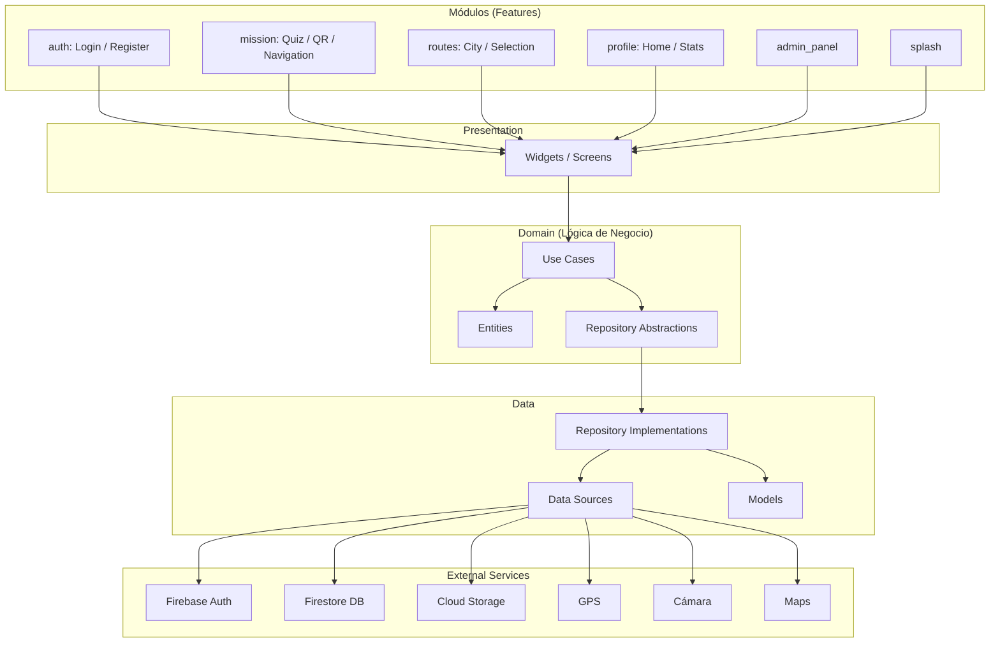
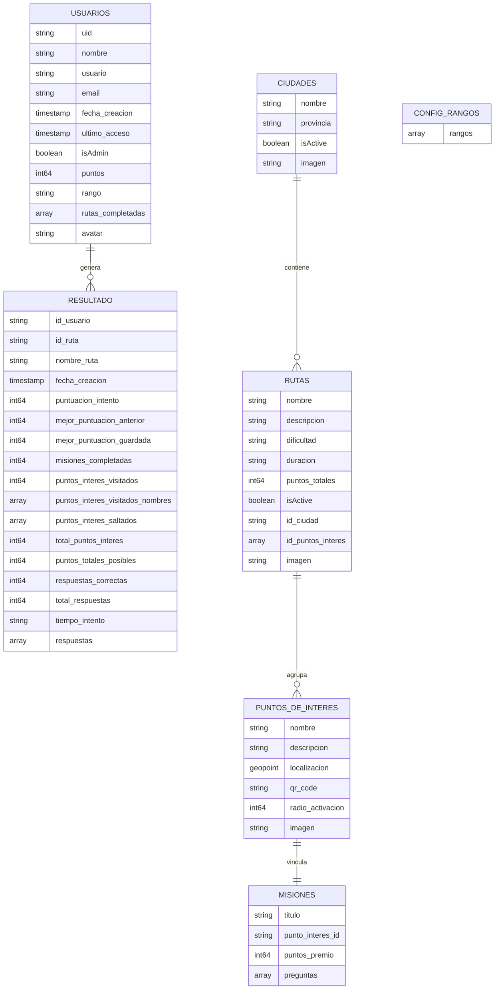
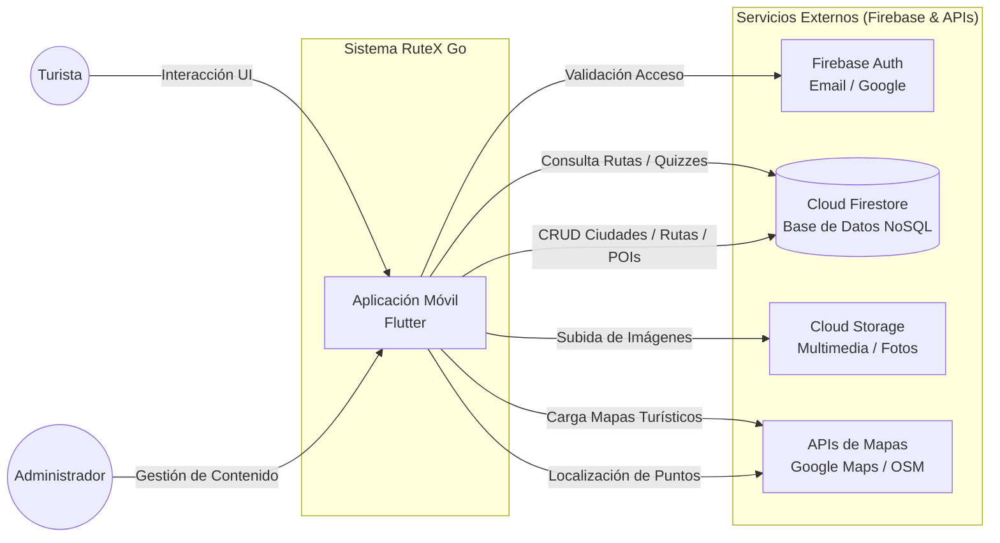
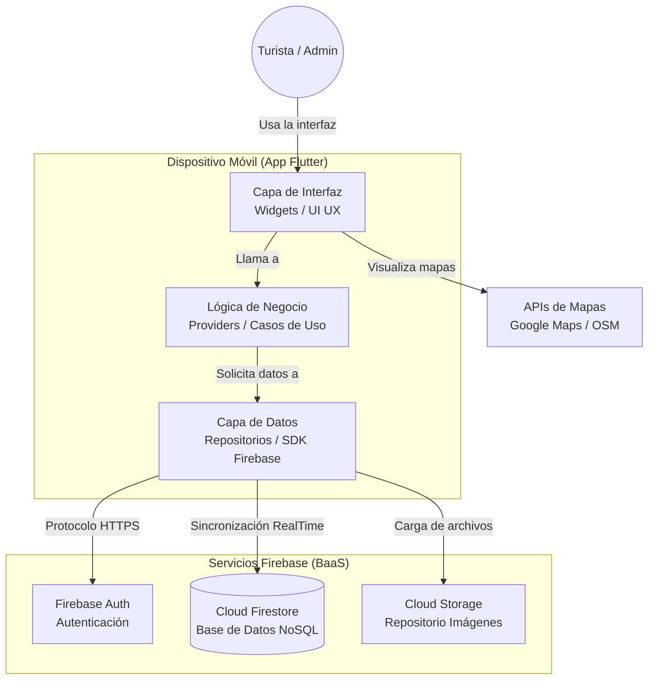

```mermaid
flowchart TD
    %% Módulos principales (Features)
    subgraph Features["Módulos (Features)"]
        direction LR
        F1[auth: Login / Register]
        F2[mission: Quiz / QR / Navigation]
        F3[routes: City / Selection]
        F4[profile: Home / Stats]
        F5[admin_panel]
        F6[splash]
    end

    %% Capas de Clean Architecture
    subgraph Presentation["Presentation"]
        direction TB
        P1[Widgets / Screens]
    end

    subgraph Domain["Domain (Lógica de Negocio)"]
        direction TB
        D1[Use Cases]
        D2[Entities]
        D3[Repository Abstractions]
    end

    subgraph Data["Data"]
        direction TB
        DA1[Repository Implementations]
        DA2[Data Sources]
        DA3[Models]
    end

    %% Servicios externos
    subgraph External["External Services"]
        direction LR
        E1[Firebase Auth]
        E2[Firestore DB]
        E3[Cloud Storage]
        E4[GPS]
        E5[Cámara]
        E6[Maps]
    end

    %% Relaciones entre módulos y capas
    F1 --> P1
    F2 --> P1
    F3 --> P1
    F4 --> P1
    F5 --> P1
    F6 --> P1

    P1 --> D1
    D1 --> D2
    D1 --> D3
    D3 --> DA1
    DA1 --> DA2
    DA1 --> DA3

    %% Relación de Data con servicios externos
    DA2 --> E1
    DA2 --> E2
    DA2 --> E3
    DA2 --> E4
    DA2 --> E5
    DA2 --> E6
```

```mermaid
erDiagram
    USUARIOS ||--o{ RESULTADO : genera
    USUARIOS {
        string uid
        string nombre
        string usuario
        string email
        timestamp fecha_creacion
        timestamp ultimo_acceso
        boolean isAdmin
        int64 puntos
        string rango
        array rutas_completadas
        string avatar
    }

    CIUDADES ||--o{ RUTAS : contiene
    CIUDADES {
        string nombre
        string provincia
        boolean isActive
        string imagen
    }

    RUTAS ||--o{ PUNTOS_DE_INTERES : agrupa
    RUTAS {
        string nombre
        string descripcion
        string dificultad
        string duracion
        int64 puntos_totales
        boolean isActive
        string id_ciudad
        array id_puntos_interes
        string imagen
    }

    PUNTOS_DE_INTERES ||--|| MISIONES : vincula
    PUNTOS_DE_INTERES {
        string nombre
        string descripcion
        geopoint localizacion
        string qr_code
        int64 radio_activacion
        string imagen
    }

    MISIONES {
        string titulo
        string punto_interes_id
        int64 puntos_premio
        array preguntas
    }

    RESULTADO {
        string id_usuario
        string id_ruta
        string nombre_ruta
        timestamp fecha_creacion
        int64 puntuacion_intento
        int64 mejor_puntuacion_anterior
        int64 mejor_puntuacion_guardada
        int64 misiones_completadas
        int64 puntos_interes_visitados
        array puntos_interes_visitados_nombres
        array puntos_interes_saltados
        int64 total_puntos_interes
        int64 puntos_totales_posibles
        int64 respuestas_correctas
        int64 total_respuestas
        string tiempo_intento
        array respuestas
    }

    CONFIG_RANGOS {
        array rangos
    }
```

```mermaid
graph LR
    %% Actores
    U1((Turista))
    U2((Administrador))

    %% Sistema Central
    subgraph "Sistema RuteX Go"
        App[Aplicación Móvil<br/>Flutter]
    end

    %% Servicios Externos
    subgraph "Servicios Externos (Firebase & APIs)"
        Auth[Firebase Auth<br/>Email / Google]
        Firestore[(Cloud Firestore<br/>Base de Datos NoSQL)]
        Storage[Cloud Storage<br/>Multimedia / Fotos]
        Maps[APIs de Mapas<br/>Google Maps / OSM]
    end

    %% Flujo de interacciones del Turista
    U1 -- "Interacción UI" --> App
    App -- "Validación Acceso" --> Auth
    App -- "Consulta Rutas / Quizzes" --> Firestore
    App -- "Carga Mapas Turísticos" --> Maps

    %% Flujo de interacciones del Admin
    U2 -- "Gestión de Contenido" --> App
    App -- "CRUD Ciudades / Rutas / POIs" --> Firestore
    App -- "Subida de Imágenes" --> Storage
    App -- "Localización de Puntos" --> Maps
```

```mermaid
graph TB
    %% Actores
    User((Turista / Admin))

    %% Contenedor Aplicación Móvil
    subgraph "Dispositivo Móvil (App Flutter)"
        UI[Capa de Interfaz<br/>Widgets / UI UX]
        Logic[Lógica de Negocio<br/>Providers / Casos de Uso]
        Data[Capa de Datos<br/>Repositorios / SDK Firebase]
    end

    %% Contenedor Backend
    subgraph "Servicios Firebase (BaaS)"
        Auth[Firebase Auth<br/>Autenticación]
        Firestore[(Cloud Firestore<br/>Base de Datos NoSQL)]
        Storage[Cloud Storage<br/>Repositorio Imágenes]
    end

    %% Servicios Externos
    Maps[APIs de Mapas<br/>Google Maps / OSM]

    %% Flujos de comunicación
    User -- "Usa la interfaz" --> UI
    UI -- "Llama a" --> Logic
    Logic -- "Solicita datos a" --> Data

    Data -- "Protocolo HTTPS" --> Auth
    Data -- "Sincronización RealTime" --> Firestore
    Data -- "Carga de archivos" --> Storage
    UI -- "Visualiza mapas" --> Maps
```
