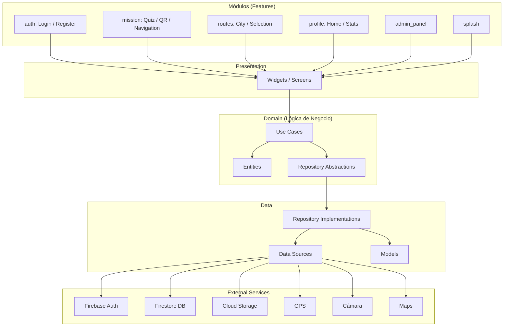
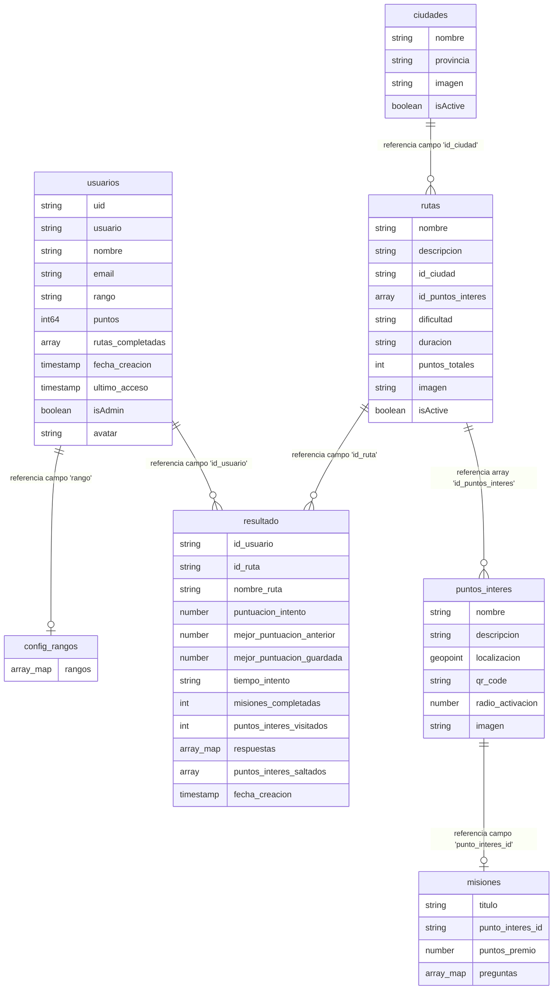

```mermaid
flowchart TD
    %% Módulos principales (Features)
    subgraph Features["Módulos (Features)"]
        direction LR
        F1[auth: Login / Register]
        F2[mission: Quiz / QR / Navigation]
        F3[routes: City / Selection]
        F4[profile: Home / Stats]
        F5[admin_panel]
        F6[splash]
    end

    %% Capas de Clean Architecture
    subgraph Presentation["Presentation"]
        direction TB
        P1[Widgets / Screens]
    end

    subgraph Domain["Domain (Lógica de Negocio)"]
        direction TB
        D1[Use Cases]
        D2[Entities]
        D3[Repository Abstractions]
    end

    subgraph Data["Data"]
        direction TB
        DA1[Repository Implementations]
        DA2[Data Sources]
        DA3[Models]
    end

    %% Servicios externos
    subgraph External["External Services"]
        direction LR
        E1[Firebase Auth]
        E2[Firestore DB]
        E3[Cloud Storage]
        E4[GPS]
        E5[Cámara]
        E6[Maps]
    end

    %% Relaciones entre módulos y capas
    F1 --> P1
    F2 --> P1
    F3 --> P1
    F4 --> P1
    F5 --> P1
    F6 --> P1

    P1 --> D1
    D1 --> D2
    D1 --> D3
    D3 --> DA1
    DA1 --> DA2
    DA1 --> DA3

    %% Relación de Data con servicios externos
    DA2 --> E1
    DA2 --> E2
    DA2 --> E3
    DA2 --> E4
    DA2 --> E5
    DA2 --> E6
```

```mermaid
erDiagram
    usuarios ||--o| config_rangos : "referencia campo 'rango'"
    usuarios ||--o{ resultado : "referencia campo 'id_usuario'"
    ciudades ||--o{ rutas : "referencia campo 'id_ciudad'"
    rutas ||--o{ puntos_interes : "referencia array 'id_puntos_interes'"
    puntos_interes ||--o| misiones : "referencia campo 'punto_interes_id'"
    rutas ||--o{ resultado : "referencia campo 'id_ruta'"

    usuarios {
        string uid
        string usuario
        string nombre
        string email
        string rango
        int64 puntos
        array rutas_completadas
        timestamp fecha_creacion
        timestamp ultimo_acceso
        boolean isAdmin
        string avatar
    }

    ciudades {
        string nombre
        string provincia
        string imagen
        boolean isActive
    }

    rutas {
        string nombre
        string descripcion
        string id_ciudad
        array id_puntos_interes
        string dificultad
        string duracion
        int puntos_totales
        string imagen
        boolean isActive
    }

    puntos_interes {
        string nombre
        string descripcion
        geopoint localizacion
        string qr_code
        number radio_activacion
        string imagen
    }

    misiones {
        string titulo
        string punto_interes_id
        number puntos_premio
        array_map preguntas
    }

    resultado {
        string id_usuario
        string id_ruta
        string nombre_ruta
        number puntuacion_intento
        number mejor_puntuacion_anterior
        number mejor_puntuacion_guardada
        string tiempo_intento
        int misiones_completadas
        int puntos_interes_visitados
        array_map respuestas
        array puntos_interes_saltados
        timestamp fecha_creacion
    }

    config_rangos {
        array_map rangos
    }
```
